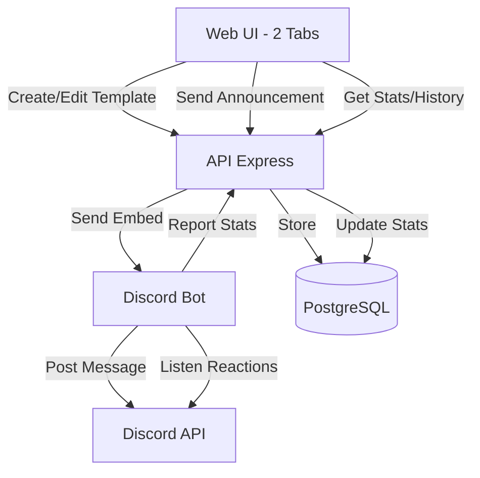

# Plan: Sistema de Templates y Gestión de Anuncios

## Arquitectura

## Cambios en Base de Datos

### Nueva tabla: `announcement_templates`
Guardar templates reutilizables con nombre y configuración de embed:
- `id`, `name`, `title`, `description`, `color`, `thumbnail_url`, `image_url`, `footer_text`, `footer_icon_url`, `author_name`, `author_icon_url`, `url`, `created_by`, `created_at`, `updated_at`

### Modificar tabla: `announcements`
Agregar tracking y relaciones:
- `template_id` (FK opcional a templates)
- `discord_message_id` (snowflake del mensaje enviado)
- `discord_channel_id` (canal donde se envió)
- `sent_at` (timestamp del envío)
- `status` (draft/sent/deleted)

### Nueva tabla: `announcement_reactions`
Trackear reacciones de usuarios:
- `id`, `announcement_id` (FK), `emoji`, `user_id`, `user_name`, `added_at`, `removed_at`

Archivos: `database/migrations/011_announcement_templates.sql`

## Backend API

### Nuevos endpoints en `api/src/routes/announcements.ts`:

**Templates:**
- `GET /api/announcements/templates` - Listar todos los templates
- `POST /api/announcements/templates` - Crear template
- `PUT /api/announcements/templates/:id` - Actualizar template
- `DELETE /api/announcements/templates/:id` - Borrar template

**Gestión de anuncios:**
- `PUT /api/announcements/:id` - Editar anuncio (solo drafts)
- `DELETE /api/announcements/:id` - Marcar como deleted
- `GET /api/announcements/:id/stats` - Estadísticas de reacciones

**Modificar existente:**
- `POST /api/announcements/:id/send` - Actualizar para guardar `discord_message_id` y `discord_channel_id`

### Nuevos modelos:
- `api/src/models/AnnouncementTemplate.ts` - CRUD completo para templates
- Extender `api/src/models/Announcement.ts` - Agregar update, soft delete, stats queries

### Modificar servicio:
- `api/src/services/announcementService.ts` - Capturar `messageId` del response del bot

## Bot de Discord

### Nuevos endpoints HTTP en `bot/src/index.ts`:

**Gestión de mensajes:**
- `PATCH /edit-embed` - Editar mensaje embed existente
  - Body: `{ channelId, messageId, embedData }`
  - Usa `message.edit({ embeds: [newEmbed] })`
  
- `DELETE /delete-message` - Borrar mensaje (reutilizar `/delete-channel-message` existente)

### Nuevos listeners de eventos:

**Tracking de reacciones:**
- `MessageReactionAdd` - Cuando alguien reacciona
- `MessageReactionRemove` - Cuando alguien quita reacción
- Filtrar por mensajes que están en tabla `announcements`
- POST a `api/announcements/reactions` con: `{ announcement_id, emoji, user_id, user_name, action: 'add'/'remove' }`

**Configuración:**
- Agregar `GatewayIntentBits.GuildMessageReactions` a intents
- Habilitar partial `Partials.Reaction` para mensajes no cacheados

Archivos: `bot/src/events/announcementReactions.ts`

## Frontend Web

### Restructurar `web/src/pages/Announcements.tsx`:

**Implementar sistema de tabs** (patrón de `TicketMetrics.tsx`):

#### Tab 1: "Editor y Templates"
Contenido:
- Selector de templates (dropdown con templates guardados)
- Botones: "Cargar Template" | "Guardar como Template" | "Actualizar Template"
- `AnnouncementEditor` existente (el form actual)
- `EmbedPreview` (preview actual)
- `ChannelSelector`
- Botón "Enviar Anuncio"

#### Tab 2: "Historial y Estadísticas"
Contenido:
- Filtros: búsqueda por título, rango de fechas, canal
- Tabla con columnas:
  - Título
  - Canal
  - Fecha envío
  - Reacciones (badges con emoji + count)
  - Acciones: Ver | Editar (solo si no enviado) | Borrar
- Modal de detalle:
  - Preview del embed
  - Estadísticas de reacciones (list con usuarios)
  - Botón "Editar en Discord" (abre modal para editar el mensaje ya enviado)
  - Botón "Eliminar Mensaje"

### Nuevos componentes:

- `web/src/components/TemplateSelector.tsx` - Dropdown con templates
- `web/src/components/TemplateManager.tsx` - Modal para guardar/actualizar template
- `web/src/components/AnnouncementHistory.tsx` - Tabla de historial
- `web/src/components/AnnouncementStatsModal.tsx` - Modal con estadísticas detalladas

### Types:
- Extender `web/src/types/Announcement.ts`:
  - `AnnouncementTemplate` interface
  - `AnnouncementWithStats` interface
  - `ReactionStats` interface

## Flujos de Usuario

### Crear y usar template:
1. Usuario llena form en tab "Editor y Templates"
2. Click "Guardar como Template" → modal pide nombre
3. Template aparece en dropdown selector
4. En futuro: seleccionar template → form se rellena automáticamente

### Enviar anuncio:
1. Llenar form (manualmente o desde template)
2. Seleccionar canal
3. Click "Enviar" → API crea registro + bot envía → guarda `message_id`
4. Success → cambiar a tab "Historial" automáticamente

### Ver estadísticas:
1. Tab "Historial" muestra tabla con todos los anuncios
2. Badges muestran reacciones en vivo (emoji + número)
3. Click en anuncio → modal con detalles y lista de usuarios que reaccionaron

### Editar anuncio enviado:
1. En historial, click "Editar en Discord"
2. Modal permite modificar embed
3. Submit → API → Bot edita mensaje en Discord
4. Reacciones se mantienen

### Borrar anuncio:
1. Click "Eliminar" en historial
2. Confirmación → Bot borra mensaje de Discord
3. Registro marcado como `status='deleted'` en DB

## Consideraciones Técnicas

**Sincronización de reacciones:**
- Bot escucha eventos en tiempo real
- Para mensajes antiguos: al cargar historial, opcionalmente hacer fetch de reacciones actuales via Discord API

**Permisos:**
- Verificar que bot tenga permisos: `VIEW_CHANNEL`, `SEND_MESSAGES`, `EMBED_LINKS`, `READ_MESSAGE_HISTORY`, `ADD_REACTIONS`, `MANAGE_MESSAGES`

**Manejo de errores:**
- Si mensaje ya fue borrado en Discord, mostrar error al intentar editar
- Validar que mensaje existe antes de editar/borrar

**Performance:**
- Paginar historial de anuncios (similar a tickets)
- Índices en DB para queries de stats

**Diseño BMW:**
- Seguir `.cursor/DESIGN.md` para todos los componentes nuevos
- Usar design tokens y componentes consistentes
