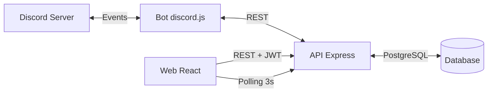
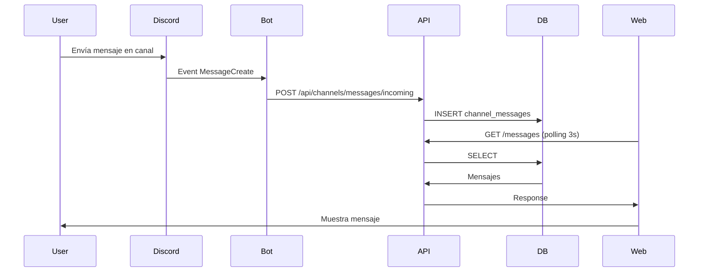
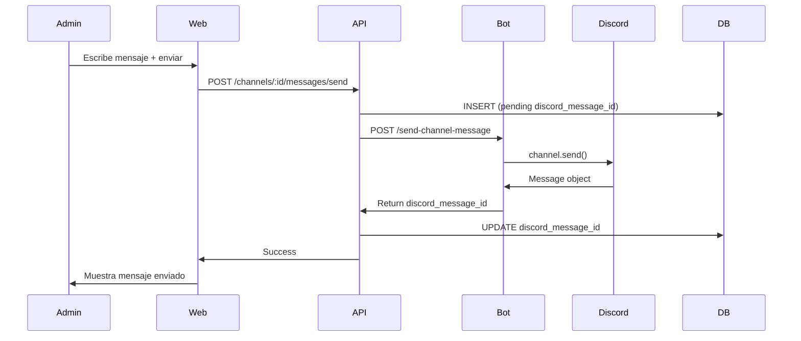
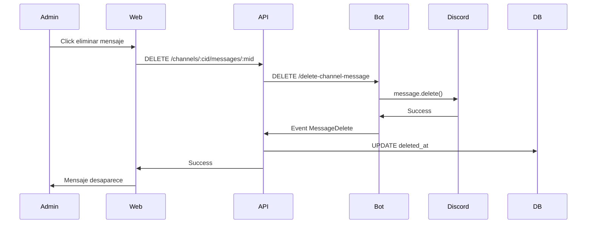

# Sistema de Gestión de Canales Discord

## Arquitectura General

El sistema reutilizará el patrón existente de DMs (Bot → API → Web) pero adaptado para canales de servidor con sincronización continua y UI estilo Discord.



## Estrategia de Ejecución Paralela

Este plan está diseñado para ejecutarse con múltiples subagentes en paralelo, organizados en fases:

### Fase 1: Prerequisito (secuencial)
- **DB Migration** - crear schema primero

### Fase 2: Capas independientes (3 subagentes en paralelo)
Una vez completada la migración DB, estas 3 capas son completamente independientes:

1. **Subagent Bot**: `bot-intents`, `bot-sync`, `bot-http`
   - Añadir intents GuildMessages
   - Implementar event handlers (channelSync.ts, channelMessageSync.ts)
   - Añadir endpoints HTTP (/send-channel-message, etc.)
   
2. **Subagent API**: `api-models`, `api-routes`, `api-service`
   - Crear modelos Channel + ChannelMessage
   - Crear rutas channels.ts + channelMessages.ts
   - Crear ChannelService para comunicación con bot

3. **Subagent Web-Base**: `web-types`, `web-api-client`
   - Crear tipos TypeScript
   - Extender api.ts con métodos nuevos

### Fase 3: Componentes Web (5 subagentes en paralelo)
Una vez API y tipos están listos, los componentes son independientes:

1. **Subagent Web-Sidebar**: `web-sidebar`
2. **Subagent Web-Chat**: `web-chat`
3. **Subagent Web-Mention**: `web-mention`
4. **Subagent Web-Modals**: `web-create-modal`, `web-header`
5. **Subagent Web-Page**: `web-page`, `web-routing`

### Fase 4: Final (secuencial)
- **Testing** - validación manual completa

**Ventaja:** Reducir tiempo de desarrollo de ~17 tareas secuenciales a ~4 fases con hasta 5 subagents paralelos.

**Dependencias clave:**
- Fase 2 requiere Fase 1 (DB schema debe existir)
- Fase 3 requiere Fase 2 completa (necesita tipos y API funcionando)
- Fase 4 requiere todo (testing end-to-end)

**Referencias obligatorias para subagentes:**
- **Todos los subagents Web:** Leer [`.cursor/DESIGN.md`](.cursor/DESIGN.md) primero
- **Todos los subagents API:** Usar `Logger` de [`api/src/utils/Logger.ts`](api/src/utils/Logger.ts)
- **Bot subagent:** Seguir patrón de DMs existente en [`bot/src/index.ts`](bot/src/index.ts)

---

## 1. Base de Datos

### Nueva tabla `channels`

```sql
CREATE TABLE channels (
  id SERIAL PRIMARY KEY,
  discord_channel_id VARCHAR(255) UNIQUE NOT NULL,
  name VARCHAR(255) NOT NULL,
  type VARCHAR(50) NOT NULL,
  position INTEGER DEFAULT 0,
  parent_id VARCHAR(255),
  topic TEXT,
  created_at TIMESTAMP DEFAULT NOW(),
  updated_at TIMESTAMP DEFAULT NOW()
);
CREATE INDEX idx_channels_discord_id ON channels(discord_channel_id);
CREATE INDEX idx_channels_position ON channels(position);
```

### Nueva tabla `channel_messages`

```sql
CREATE TABLE channel_messages (
  id SERIAL PRIMARY KEY,
  channel_id INTEGER REFERENCES channels(id) ON DELETE CASCADE,
  discord_message_id VARCHAR(255) UNIQUE NOT NULL,
  author_id VARCHAR(255) NOT NULL,
  author_name VARCHAR(255) NOT NULL,
  author_avatar VARCHAR(500),
  content TEXT NOT NULL,
  mentions TEXT[],
  sent_at TIMESTAMP DEFAULT NOW(),
  edited_at TIMESTAMP,
  deleted_at TIMESTAMP
);
CREATE INDEX idx_channel_messages_channel ON channel_messages(channel_id);
CREATE INDEX idx_channel_messages_sent_at ON channel_messages(sent_at DESC);
CREATE INDEX idx_channel_messages_discord_id ON channel_messages(discord_message_id);
```

**Archivo:** `database/migrations/008_channels.sql`

**Separación vs DMs:** Los DMs usan `messages` tabla ligada a `leads`, los canales usan `channel_messages` separada porque son contextos diferentes (leads individuales vs servidor completo).

---

## 2. Bot - Discord.js

### Cambios en configuración

**Archivo:** [`bot/src/index.ts`](bot/src/index.ts)

Añadir intent `GuildMessages` para recibir mensajes de canales:

```typescript
intents: [
  GatewayIntentBits.Guilds,
  GatewayIntentBits.GuildMembers,
  GatewayIntentBits.DirectMessages,
  GatewayIntentBits.MessageContent,
  GatewayIntentBits.GuildMessages, // NUEVO
]
```

### Event handlers nuevos

**1. Sincronización de canales (`channelSync.ts`)**

Función `syncAllChannels()` ejecutada en `ClientReady` y cada 10 minutos:
- Itera `guild.channels.cache`
- Filtra tipos: texto, anuncios, foros (excluye voz/stage)
- Para cada canal: POST `/api/channels/sync` con datos del canal
- API hace upsert por `discord_channel_id`

**2. Sincronización de mensajes por canal (`channelMessageSync.ts`)**

Función `syncChannelMessages(channelId)` ejecutada para cada canal:
- Fetch últimos 50 mensajes: `channel.messages.fetch({ limit: 50 })`
- Para cada mensaje: GET `/api/channels/messages/check/:discordMessageId`
- Si no existe: POST `/api/channels/messages/incoming`

**3. Mensajes en tiempo real**

Modificar handler existente `Events.MessageCreate`:

```typescript
// Ya existe lógica para DMs
if (message.channel.type === ChannelType.DM) {
  // ... código existente DM ...
}

// NUEVO: Mensajes de canales de servidor
if (message.guild && message.channel.isTextBased()) {
  await axios.post(`${config.apiUrl}/api/channels/messages/incoming`, {
    discord_message_id: message.id,
    discord_channel_id: message.channel.id,
    author_id: message.author.id,
    author_name: message.author.tag,
    author_avatar: message.author.displayAvatarURL(),
    content: message.content,
    mentions: message.mentions.users.map(u => u.id)
  });
}
```

**4. Event `channelCreate` / `channelUpdate` / `channelDelete`**

```typescript
client.on(Events.ChannelCreate, async (channel) => {
  if (channel.guild && channel.type !== ChannelType.GuildVoice) {
    await axios.post(`${config.apiUrl}/api/channels/sync`, {...});
  }
});

client.on(Events.ChannelDelete, async (channel) => {
  await axios.delete(`${config.apiUrl}/api/channels/${channel.id}`);
});
```

**5. Event `messageDelete` / `messageUpdate`**

```typescript
client.on(Events.MessageDelete, async (message) => {
  if (message.guild) {
    await axios.patch(
      `${config.apiUrl}/api/channels/messages/${message.id}/delete`
    );
  }
});

client.on(Events.MessageUpdate, async (oldMsg, newMsg) => {
  if (newMsg.guild && newMsg.content) {
    await axios.patch(
      `${config.apiUrl}/api/channels/messages/${newMsg.id}`,
      { content: newMsg.content }
    );
  }
});
```

### Nuevos endpoints HTTP en bot

**Archivo:** `bot/src/index.ts` (Express routes)

```typescript
// Enviar mensaje a canal
app.post('/send-channel-message', async (req, res) => {
  const { channelId, content, mentions } = req.body;
  const channel = await client.channels.fetch(channelId);
  if (!channel.isTextBased()) return res.status(400).json({...});
  
  const message = await channel.send({
    content: content,
    allowedMentions: { users: mentions || [] }
  });
  
  res.json({ success: true, discord_message_id: message.id });
});

// Eliminar mensaje
app.delete('/delete-channel-message', async (req, res) => {
  const { channelId, messageId } = req.body;
  const channel = await client.channels.fetch(channelId);
  const message = await channel.messages.fetch(messageId);
  await message.delete();
  res.json({ success: true });
});

// Crear canal
app.post('/create-channel', async (req, res) => {
  const { name, type, topic, parentId } = req.body;
  const guild = client.guilds.cache.first();
  const channel = await guild.channels.create({
    name,
    type: type || ChannelType.GuildText,
    topic,
    parent: parentId || null
  });
  res.json({ success: true, channel_id: channel.id });
});

// Eliminar canal
app.delete('/delete-channel', async (req, res) => {
  const { channelId } = req.body;
  const channel = await client.channels.fetch(channelId);
  await channel.delete();
  res.json({ success: true });
});
```

---

## 3. API - Express

### Modelo `Channel.ts`

**Archivo:** `api/src/models/Channel.ts`

```typescript
export class ChannelModel {
  static async getAll(): Promise<Channel[]>
  static async getByDiscordId(discordId: string): Promise<Channel | null>
  static async upsert(data: ChannelData): Promise<Channel>
  static async delete(discordChannelId: string): Promise<void>
}
```

### Modelo `ChannelMessage.ts`

**Archivo:** `api/src/models/ChannelMessage.ts`

```typescript
export class ChannelMessageModel {
  static async getByChannel(channelId: number, limit: number): Promise<Message[]>
  static async create(data: MessageData): Promise<Message>
  static async exists(discordMessageId: string): Promise<boolean>
  static async update(discordMessageId: string, content: string): Promise<void>
  static async softDelete(discordMessageId: string): Promise<void>
}
```

### Routes `/api/channels`

**Archivo:** `api/src/routes/channels.ts`

| Método | Path | Auth | Descripción |
|--------|------|------|-------------|
| GET | `/api/channels` | JWT | Lista todos los canales |
| POST | `/api/channels/sync` | No | Bot webhook: upsert canal |
| DELETE | `/api/channels/:discordChannelId` | No | Bot webhook: eliminar canal |
| POST | `/api/channels/create` | JWT | CRM → Bot: crear canal nuevo |
| DELETE | `/api/channels/:discordChannelId/delete` | JWT | CRM → Bot: eliminar canal |

**Archivo:** `api/src/routes/channelMessages.ts`

| Método | Path | Auth | Descripción |
|--------|------|------|-------------|
| GET | `/api/channels/:channelId/messages` | JWT | Obtener mensajes (limit 100) |
| POST | `/api/channels/messages/incoming` | No | Bot webhook: nuevo mensaje |
| GET | `/api/channels/messages/check/:discordMessageId` | No | Bot: verificar si existe |
| POST | `/api/channels/:channelId/messages/send` | JWT | CRM → Bot: enviar mensaje |
| DELETE | `/api/channels/:channelId/messages/:discordMessageId` | JWT | CRM → Bot: eliminar mensaje |
| PATCH | `/api/channels/messages/:discordMessageId` | No | Bot webhook: editar mensaje |
| PATCH | `/api/channels/messages/:discordMessageId/delete` | No | Bot webhook: soft delete |

### Service `ChannelService.ts`

**Archivo:** `api/src/services/channelService.ts`

Similar a `botService.ts` existente:

```typescript
export class ChannelService {
  static async sendMessage(channelId: string, content: string, mentions: string[]): Promise<string>
  static async deleteMessage(channelId: string, messageId: string): Promise<void>
  static async createChannel(name: string, type?: string, topic?: string): Promise<string>
  static async deleteChannel(channelId: string): Promise<void>
}
```

Hace llamadas HTTP a `BOT_URL`:
- `POST /send-channel-message`
- `DELETE /delete-channel-message`
- `POST /create-channel`
- `DELETE /delete-channel`

---

## 4. Web - React

### Nueva ruta `/channels`

**Archivo:** `web/src/App.tsx`

Añadir ruta en React Router (o crear routing si no existe):

```tsx
<Route path="/channels" element={<ChannelsPage />} />
```

Añadir link en navegación existente.

### Página principal `ChannelsPage`

**Archivo:** `web/src/pages/ChannelsPage.tsx`

Layout estilo Discord:

```tsx
<div className="flex h-screen">
  <ChannelSidebar 
    channels={channels}
    selectedChannel={selectedChannel}
    onSelectChannel={setSelectedChannel}
    onCreateChannel={handleCreateChannel}
  />
  <div className="flex-1 flex flex-col">
    {selectedChannel ? (
      <>
        <ChannelHeader 
          channel={selectedChannel}
          onDeleteChannel={handleDeleteChannel}
        />
        <ChannelChat 
          channel={selectedChannel}
          messages={messages}
          onSendMessage={handleSendMessage}
          onDeleteMessage={handleDeleteMessage}
        />
      </>
    ) : (
      <EmptyState />
    )}
  </div>
</div>
```

**State management:**
- `channels` - lista completa
- `selectedChannel` - canal actualmente abierto
- `messages` - mensajes del canal seleccionado
- Polling cada 3s para mensajes del canal activo
- Polling cada 30s para lista de canales

### Componente `ChannelSidebar`

**Archivo:** `web/src/components/ChannelSidebar.tsx`

- Lista de canales agrupados por categoría (usando `parent_id`)
- Botón "+" para crear nuevo canal
- Indicador de canal seleccionado
- Scroll si hay muchos canales
- Diseño BMW según `.cursor/DESIGN.md`:
  - Background: `var(--bmw-surface-1)`
  - Texto: `var(--bmw-on-surface)`
  - Seleccionado: `var(--bmw-primary)` + `var(--bmw-on-primary)`

### Componente `ChannelChat`

**Archivo:** `web/src/components/ChannelChat.tsx`

Similar a `ChatModal.tsx` existente pero adaptado:

- Lista de mensajes con scroll automático
- Cada mensaje muestra:
  - Avatar del autor (si disponible)
  - Nombre del autor
  - Contenido (con menciones renderizadas)
  - Timestamp
  - Botón eliminar (hover) si es mensaje propio o admin
- Composer con textarea
- Autocompletado de menciones con `@`
- Validación 2000 caracteres
- Indicador de "enviando..."

### Componente `MemberMentionInput`

**Archivo:** `web/src/components/MemberMentionInput.tsx`

Textarea con autocompletado:

```tsx
// Detectar @ + búsqueda
// Mostrar dropdown con miembros coincidentes
// Al seleccionar: insertar <@USER_ID> en el texto
// Enviar array de IDs mencionados al backend
```

Usar endpoint existente o crear `GET /api/members` para obtener lista.

### Componente `ChannelHeader`

**Archivo:** `web/src/components/ChannelHeader.tsx`

- Nombre del canal
- Descripción/topic (si existe)
- Botón eliminar canal (con confirmación)
- Diseño BMW: `bmw-header` con borde inferior

### Componente `CreateChannelModal`

**Archivo:** `web/src/components/CreateChannelModal.tsx`

Modal con form:
- Input nombre (requerido)
- Select tipo (texto, anuncios, foro)
- Textarea topic (opcional)
- Select categoría/parent (opcional)
- Botones Cancelar / Crear
- Validación inline
- Diseño BMW según sistema de modales existente

### API Client

**Archivo:** `web/src/services/api.ts`

Añadir métodos:

```typescript
// Canales
getChannels(): Promise<Channel[]>
createChannel(data: CreateChannelData): Promise<Channel>
deleteChannel(discordChannelId: string): Promise<void>

// Mensajes de canal
getChannelMessages(channelId: number, limit?: number): Promise<Message[]>
sendChannelMessage(channelId: number, content: string, mentions: string[]): Promise<Message>
deleteChannelMessage(channelId: number, discordMessageId: string): Promise<void>
```

---

## 5. Flujo de Datos Completo

### Mensaje entrante (Discord → CRM)



### Mensaje saliente (CRM → Discord)



### Eliminación de mensaje



---

## 6. Consideraciones de Diseño

### BMW Design System

**CRÍTICO:** Todos los componentes web deben seguir estrictamente [`.cursor/DESIGN.md`](.cursor/DESIGN.md).

Este archivo define el sistema de diseño BMW completo con:
- **Tokens de color:** `--bmw-primary`, `--bmw-surface-1`, `--bmw-surface-2`, `--bmw-on-surface`, `--bmw-on-primary`, etc.
- **Tipografía:** `bmw-title-lg`, `bmw-title-md`, `bmw-body-sm`, `bmw-label-sm`
- **Componentes:** `bmw-btn-primary`, `bmw-btn-secondary`, `bmw-btn-ghost`, `bmw-input`, `bmw-card`
- **Spacing:** Sistema de 4px base (8px, 12px, 16px, 24px, 32px)
- **Elevaciones:** `elevation-1`, `elevation-2`, `elevation-3`
- **Borders:** 1px hairline con `--bmw-on-surface-variant`
- **Animations:** Transiciones de 200ms con easing específico

**Referencia obligatoria:** Leer [`.cursor/DESIGN.md`](.cursor/DESIGN.md) antes de implementar cualquier componente web.

Aplicaciones específicas para esta feature:
- **ChannelSidebar:** Background `var(--bmw-surface-1)`, texto `var(--bmw-on-surface)`, selección con `var(--bmw-primary)`
- **ChannelChat:** Burbujas de mensaje con `bmw-card`, composer con `bmw-input`
- **Modals:** Usar overlay oscuro + `bmw-card` centrado con `elevation-3`
- **Buttons:** `bmw-btn-primary` para acciones principales, `bmw-btn-secondary` para cancelar
- **Headers:** `bmw-title-md` para títulos, borde inferior con `--bmw-on-surface-variant`

### Sistema de Logging

**OBLIGATORIO:** Usar el sistema centralizado de logging en [`api/src/utils/Logger.ts`](api/src/utils/Logger.ts).

El Logger escribe a PostgreSQL tabla `system_logs` con niveles: `error`, `warning`, `info`, `debug`.

Métodos disponibles:
```typescript
Logger.error(message: string, metadata?: object, req?: Request)
Logger.warning(message: string, metadata?: object, req?: Request)
Logger.info(message: string, metadata?: object, req?: Request)
Logger.debug(message: string, metadata?: object, req?: Request)
```

**Aplicar logging en:**
- **API routes:** Todas las operaciones críticas (send message, delete message, create/delete channel)
- **API services:** Llamadas HTTP al bot (éxito y error)
- **Bot webhooks:** Operaciones de sincronización y eventos Discord
- **Bot HTTP endpoints:** Request/response de operaciones CRM → Discord

Ejemplos de uso:
```typescript
// En API route
Logger.info('Channel message sent', { channelId, messageId, userId: req.user.id }, req);
Logger.error('Failed to delete channel', { error: err.message, channelId }, req);

// En ChannelService
Logger.warning('Bot unreachable, message queued', { channelId, retryCount: 1 });

// En Bot
Logger.info('Channel sync completed', { channelCount: channels.length, duration: Date.now() - start });
Logger.error('Failed to send channel message', { error: err.message, channelId, content: content.substring(0, 50) });
```

**Visualización:** Los logs se pueden ver en:
- Web UI: `http://localhost:3003/logs`
- API: `GET /api/logs` (con filtros por nivel, fecha, búsqueda)

**Configuración:** Via env vars `ENABLE_LOGGING`, `LOG_LEVEL`, `LOG_RETENTION_DAYS` (ver `.cursor/rules/response-preferences.mdc`)

### Manejo de errores

- Bot offline: API debe capturar timeout y marcar `error` en mensaje
- Permisos insuficientes: Bot debe retornar 403, API propaga error a Web
- Canal eliminado: Soft delete en DB, mostrar estado en UI
- Mensaje muy largo: Validar 2000 chars en Web antes de enviar

### Performance

- **Sincronización inicial:** Solo últimos 50 mensajes por canal (configurable)
- **Polling:** Solo canal activo se actualiza cada 3s
- **Lista de canales:** Cachear en Web, refrescar cada 30s o en eventos create/delete
- **Índices DB:** Ya incluidos en schema para queries frecuentes

---

## 7. Archivos Modificados/Creados

### Base de datos
- `database/migrations/008_channels.sql` (NUEVO)

### Bot
- `bot/src/index.ts` (MODIFICAR: añadir intent, events, endpoints HTTP)
- `bot/src/events/channelSync.ts` (NUEVO)
- `bot/src/events/channelMessageSync.ts` (NUEVO)

### API
- `api/src/models/Channel.ts` (NUEVO)
- `api/src/models/ChannelMessage.ts` (NUEVO)
- `api/src/routes/channels.ts` (NUEVO)
- `api/src/routes/channelMessages.ts` (NUEVO)
- `api/src/services/channelService.ts` (NUEVO)
- `api/src/index.ts` (MODIFICAR: registrar nuevas rutas)

### Web
- `web/src/pages/ChannelsPage.tsx` (NUEVO)
- `web/src/components/ChannelSidebar.tsx` (NUEVO)
- `web/src/components/ChannelChat.tsx` (NUEVO)
- `web/src/components/ChannelHeader.tsx` (NUEVO)
- `web/src/components/MemberMentionInput.tsx` (NUEVO)
- `web/src/components/CreateChannelModal.tsx` (NUEVO)
- `web/src/services/api.ts` (MODIFICAR: añadir métodos)
- `web/src/types/Channel.ts` (NUEVO)
- `web/src/types/ChannelMessage.ts` (NUEVO)
- `web/src/App.tsx` (MODIFICAR: añadir ruta)

### Total: ~18 archivos (9 nuevos, 4 modificados, 2 migraciones DB)

---

## 8. Testing Manual

1. **Sincronización inicial:** Reiniciar bot, verificar que canales y mensajes se importan a DB
2. **Mensaje entrante:** Enviar desde Discord, verificar aparece en CRM en <3s
3. **Mensaje saliente:** Enviar desde CRM, verificar aparece en Discord y se guarda discord_message_id
4. **Menciones:** Usar @ en CRM, verificar que en Discord se renderiza como mención
5. **Eliminar mensaje:** Eliminar desde CRM, verificar desaparece en Discord y DB
6. **Crear canal:** Crear desde CRM, verificar aparece en Discord y en sidebar
7. **Eliminar canal:** Eliminar desde CRM, verificar desaparece en Discord y soft delete en DB
8. **Polling:** Enviar desde Discord, esperar máx 3s, verificar aparece en CRM sin refresh manual
9. **Edición de mensaje:** Editar en Discord, verificar se actualiza en CRM
10. **UI responsive:** Verificar diseño BMW en diferentes tamaños de pantalla

---

## 9. Notas de Seguridad

- Endpoints `/sync`, `/incoming`, `/check` sin JWT: asumir red interna (como DMs actuales)
- Producción: considerar API key compartida entre Bot y API
- Validar permisos de bot en Discord antes de operaciones (ManageChannels, ManageMessages)
- Sanitizar contenido de mensajes antes de renderizar en Web (XSS)
- Rate limiting en endpoints públicos para evitar spam

---

## 10. Referencias Críticas por Fase

### Para Fase 1 (DB Migration)
- [`database/migrations/003_conversations.sql`](database/migrations/003_conversations.sql) - patrón de migración existente
- Schema existente en migrations 001-007

### Para Fase 2 - Subagent Bot
**Archivos de referencia obligatorios:**
- [`bot/src/index.ts`](bot/src/index.ts) - estructura actual, intents, event handlers DM, endpoints HTTP
- [`bot/src/config.ts`](bot/src/config.ts) - configuración API_URL, BOT_HTTP_PORT
- Patrón de sincronización DM existente (MessageCreate handler, syncAllDMs, syncDMChannel)

### Para Fase 2 - Subagent API
**Archivos de referencia obligatorios:**
- [`api/src/models/Message.ts`](api/src/models/Message.ts) - patrón de modelo existente
- [`api/src/routes/messages.ts`](api/src/routes/messages.ts) - patrón de rutas webhook + JWT
- [`api/src/services/botService.ts`](api/src/services/botService.ts) - patrón de comunicación con bot
- [`api/src/utils/Logger.ts`](api/src/utils/Logger.ts) - **OBLIGATORIO** usar en todos los endpoints
- [`api/src/index.ts`](api/src/index.ts) - registrar nuevas rutas aquí

### Para Fase 2 - Subagent Web-Base
**Archivos de referencia obligatorios:**
- [`web/src/types/Lead.ts`](web/src/types/Lead.ts) - patrón de tipos existente
- [`web/src/services/api.ts`](web/src/services/api.ts) - cliente API con interceptors, estructura

### Para Fase 3 - Todos los Subagents Web
**Archivos de referencia CRÍTICOS:**
- [`.cursor/DESIGN.md`](.cursor/DESIGN.md) - **LEER PRIMERO**, sistema de diseño BMW completo
- [`web/src/components/ChatModal.tsx`](web/src/components/ChatModal.tsx) - patrón de mensajería con polling
- [`web/src/components/LeadModal.tsx`](web/src/components/LeadModal.tsx) - patrón de modal BMW
- [`web/src/components/LeadCard.tsx`](web/src/components/LeadCard.tsx) - uso de design tokens BMW
- [`web/src/App.tsx`](web/src/App.tsx) - estructura de navegación

**Design tokens BMW más usados:**
- Colors: `--bmw-primary`, `--bmw-surface-1`, `--bmw-surface-2`, `--bmw-on-surface`, `--bmw-on-primary`
- Typography: `bmw-title-md`, `bmw-body-sm`, `bmw-label-sm`
- Components: `bmw-btn-primary`, `bmw-btn-secondary`, `bmw-input`, `bmw-card`
- Spacing: múltiplos de 4px (8px, 12px, 16px, 24px)

### Para Fase 4 - Testing
- Sistema de logs: `http://localhost:3003/logs`
- API docs en plan (sección 3 y 5)
- Verificar diseño BMW con [`.cursor/DESIGN.md`](.cursor/DESIGN.md)
