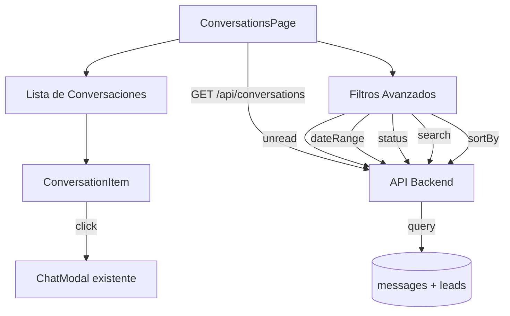

# Centro de Conversaciones DM

## Arquitectura



## Backend: API de Conversaciones

Crear nuevo endpoint en [`api/src/features/leads/routes/conversations.ts`](api/src/features/leads/routes/conversations.ts):

**GET `/api/conversations`** - Lista todas las conversaciones con:
- Query params: `unread`, `status`, `search`, `sortBy`, `dateFrom`, `dateTo`
- Agrupa mensajes por `lead_id`
- Devuelve por cada conversación:
  - Info del lead (id, name, email, discord_id, status, avatar)
  - Último mensaje (content, sent_at, sender_type)
  - Count de mensajes no leídos (sender_type='user' AND read_at IS NULL)
  - Total de mensajes
  - Timestamp del último mensaje

**Query SQL optimizada:**
```sql
SELECT 
  l.id, l.name, l.email, l.discord_id, l.status,
  MAX(m.sent_at) as last_message_at,
  COUNT(CASE WHEN m.sender_type='user' AND m.read_at IS NULL THEN 1 END) as unread_count,
  COUNT(m.id) as total_messages,
  (SELECT content FROM messages WHERE lead_id = l.id ORDER BY sent_at DESC LIMIT 1) as last_message_content,
  (SELECT sender_type FROM messages WHERE lead_id = l.id ORDER BY sent_at DESC LIMIT 1) as last_sender_type
FROM leads l
INNER JOIN messages m ON m.lead_id = l.id
WHERE l.discord_id IS NOT NULL
GROUP BY l.id
ORDER BY last_message_at DESC
```

Aplicar filtros según query params:
- `unread=true`: `HAVING COUNT(...) > 0`
- `status`: `WHERE l.status = :status`
- `search`: `WHERE l.name ILIKE :search OR l.email ILIKE :search`
- `sortBy`: last_message, unread_count, name
- `dateFrom/dateTo`: `WHERE m.sent_at BETWEEN :from AND :to`

**Archivos a modificar:**
- Crear [`api/src/features/leads/routes/conversations.ts`](api/src/features/leads/routes/conversations.ts)
- Crear [`api/src/features/leads/controllers/ConversationController.ts`](api/src/features/leads/controllers/ConversationController.ts)
- Registrar ruta en [`api/src/index.ts`](api/src/index.ts): `app.use('/api/conversations', authMiddleware, conversationRoutes)`

## Frontend: Vista de Conversaciones

### 1. Servicio de API

Agregar en [`web/src/services/api.ts`](web/src/services/api.ts):
```typescript
getConversations(filters?: {
  unread?: boolean;
  status?: string;
  search?: string;
  sortBy?: string;
  dateFrom?: string;
  dateTo?: string;
}): Promise<Conversation[]>
```

Nuevo tipo en `web/src/types/Conversation.ts`:
```typescript
interface Conversation {
  lead: Lead;
  lastMessage: {
    content: string;
    sentAt: string;
    senderType: 'user' | 'admin';
  };
  unreadCount: number;
  totalMessages: number;
}
```

### 2. Página de Conversaciones

Crear [`web/src/pages/ConversationsPage.tsx`](web/src/pages/ConversationsPage.tsx):

**Estructura:**
- Header con título "Conversaciones" + contador total
- Barra de filtros avanzados (componente separado)
- Lista scrollable de conversaciones
- Modal de chat al seleccionar conversación

**Estado:**
- `conversations`: array de conversaciones
- `selectedLead`: lead actual para ChatModal
- `filters`: estado de filtros activos
- `loading`, `error`

**Polling:**
- Refrescar lista cada 5 segundos para nuevos mensajes
- Optimizar: solo actualizar si hay cambios (comparar timestamps)

### 3. Componente de Filtros

Crear [`web/src/components/conversations/ConversationFilters.tsx`](web/src/components/conversations/ConversationFilters.tsx):

**Filtros:**
- Toggle "Solo no leídas" (default: off)
- Select de estados: Todos, Nuevo, Contactado, Calificado, Propuesta, Ganado, Perdido
- Input de búsqueda (debounce 300ms)
- DateRangePicker (de-hasta)
- Select ordenamiento: Más reciente, Más antigua, Más no leídas, A-Z

**Design tokens (según DESIGN.md):**
- Usar BMW Form components
- Color scheme bmw-blue para activos
- Spacing system (4px base)

### 4. Item de Conversación

Crear [`web/src/components/conversations/ConversationItem.tsx`](web/src/components/conversations/ConversationItem.tsx):

**Layout:**
```
[Avatar] [Nombre + Estado]        [Hora]
         [Preview último mensaje]  [Badge unread]
```

**Props:**
- `conversation: Conversation`
- `onClick: () => void`

**Features:**
- Avatar del lead (usar MemberAvatar existente o similar)
- Badge con status del lead (StatusPill existente)
- Preview del último mensaje (truncado max 60 chars)
- Badge con count de no leídos (solo si > 0)
- Timestamp relativo ("hace 2 min", "ayer", etc.)
- Indicador visual: negrita si no leído
- Hover effect según BMW design

### 5. Integración con ChatModal

Reutilizar [`web/src/components/leads/ChatModal.tsx`](web/src/components/leads/ChatModal.tsx) existente:

**Modificación mínima:**
- Ya recibe `lead` y `onClose`
- Al cerrar modal, refrescar lista de conversaciones
- Cuando se envía mensaje, actualizar unread count
- Callback opcional `onMessageSent` para notificar a parent

### 6. Routing

Modificar [`web/src/main.tsx`](web/src/main.tsx):
- Agregar ruta: `/conversations` → `<ConversationsPage />`

Modificar [`web/src/components/ui/Layout.tsx`](web/src/components/ui/Layout.tsx):
- Agregar link en sidebar: "Conversaciones" con ícono de chat
- Posicionar después del Kanban, antes de Members
- Badge con total de no leídas (estado global o fetch ligero)

## Mejoras Adicionales

### Notificaciones en tiempo real (opcional)
Si en el futuro se agrega WebSocket:
- Suscribirse a eventos de nuevos mensajes
- Actualizar lista sin polling
- Notificación visual/sonora

### Optimizaciones
- Virtualización de lista si hay 100+ conversaciones
- Cache de conversaciones con React Query o SWR
- Paginación/infinite scroll si escalabilidad es concern

### UX
- Placeholder cuando no hay conversaciones
- Estado de carga con skeleton loaders
- Manejo de errores con retry
- Tooltip en items con info completa del lead

## Estructura de Archivos Resultante

```
api/src/features/leads/
  ├── routes/
  │   ├── messages.ts (existente)
  │   └── conversations.ts (nuevo)
  └── controllers/
      └── ConversationController.ts (nuevo)

web/src/
  ├── pages/
  │   └── ConversationsPage.tsx (nuevo)
  ├── components/
  │   └── conversations/ (nuevo directorio)
  │       ├── ConversationFilters.tsx
  │       ├── ConversationItem.tsx
  │       └── ConversationList.tsx
  ├── types/
  │   └── Conversation.ts (nuevo)
  └── services/
      └── api.ts (modificar)
```

## Flujo de Usuario

1. Usuario accede a `/conversations` desde sidebar
2. Ve lista de todas las conversaciones ordenadas por reciente
3. Aplica filtro "Solo no leídas" → lista se actualiza
4. Busca por nombre "John" → filtra en tiempo real
5. Click en conversación → abre ChatModal
6. Lee mensajes → marca automáticamente como leído
7. Responde al lead → mensaje se envía y aparece en chat
8. Cierra modal → vuelve a lista actualizada
9. Badge de no leídos se actualiza en sidebar

## Dependencias Técnicas

**Sin nuevas dependencias:**
- Usar date-fns (ya instalado) para timestamps relativos
- Usar BMW design tokens de DESIGN.md
- Reutilizar componentes existentes (StatusPill, MemberAvatar, ChatModal)

**Testing:**
- Probar filtros combinados (unread + status + search)
- Verificar performance con 50+ conversaciones
- Validar polling no causa memory leaks
- Responsive design en mobile