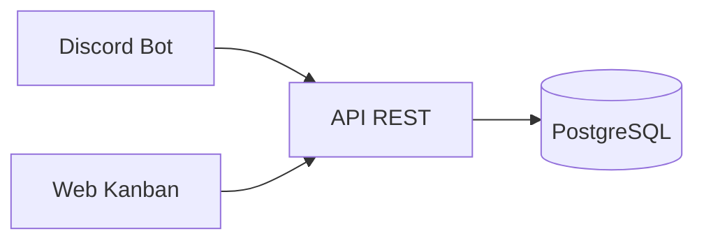

# CRM de Leads con Kanban - Plan de Implementación

## Arquitectura del Sistema

Sistema compuesto por tres componentes conectados a PostgreSQL:

1. **Discord Bot** - Captura rápida de leads desde Discord
2. **API REST** - Backend compartido para bot y web
3. **Web App** - Panel Kanban para gestión visual



## Estructura del Proyecto

```
/home/discordbot/code/
├── bot/
│   ├── src/
│   │   ├── commands/
│   │   ├── index.ts
│   │   └── config.ts
│   ├── package.json
│   └── tsconfig.json
├── api/
│   ├── src/
│   │   ├── routes/
│   │   ├── models/
│   │   ├── middleware/
│   │   └── index.ts
│   ├── package.json
│   └── tsconfig.json
├── web/
│   ├── src/
│   │   ├── components/
│   │   ├── pages/
│   │   └── App.tsx
│   ├── package.json
│   └── vite.config.ts
└── database/
    └── migrations/
        └── 001_init.sql
```

## Base de Datos

**Tabla: leads**
- id (SERIAL PRIMARY KEY)
- name (VARCHAR NOT NULL)
- discord_id (VARCHAR UNIQUE - Discord user ID)
- discord_tag (VARCHAR - username#discriminator)
- contact_discord (VARCHAR NOT NULL)
- service_interest (TEXT)
- stage (VARCHAR: nuevo, contactado, propuesta_enviada, negociacion, ganado, perdido)
- assigned_to (VARCHAR, nullable - Discord ID del responsable)
- notes (TEXT)
- source (VARCHAR - 'auto' para nuevos miembros, 'manual' para comando)
- created_at (TIMESTAMP DEFAULT NOW())
- updated_at (TIMESTAMP DEFAULT NOW())

**Tabla: lead_history**
- id (SERIAL PRIMARY KEY)
- lead_id (INTEGER REFERENCES leads)
- action (VARCHAR - stage_change, note_added, etc)
- previous_value (TEXT)
- new_value (TEXT)
- changed_by (VARCHAR - Discord ID)
- created_at (TIMESTAMP DEFAULT NOW())

Ubicación: `database/migrations/001_init.sql`

**Notas sobre campos:**
- `discord_id`: Permite identificar usuarios únicos de Discord (evita duplicados cuando miembro se une)
- `discord_tag`: Formato username#discriminator para referencia humana
- `source`: Permite diferenciar leads auto-capturados vs ingresados manualmente

## API REST (Express + TypeScript)

**Puerto:** 3001 (interno)

**Endpoints principales:**
- `GET /api/leads` - Listar todos los leads
- `GET /api/leads/:id` - Ver detalle de lead
- `POST /api/leads` - Crear nuevo lead
- `PATCH /api/leads/:id` - Actualizar lead (cambiar stage, notas, etc)
- `DELETE /api/leads/:id` - Eliminar lead
- `GET /api/leads/:id/history` - Historial de cambios

**Dependencias:**
- express
- pg (PostgreSQL client)
- cors (para web app)
- dotenv
- typescript

**Middleware:**
- CORS configurado para permitir requests desde web app
- Body parser JSON
- Error handler centralizado

## Discord Bot (Discord.js v14)

**Captura Automática de Leads:**

El bot escucha el evento `guildMemberAdd` para detectar nuevos miembros que se unen al servidor. Al detectar uno:
- Crea automáticamente un lead llamando a API POST /api/leads
- Datos capturados:
  - name: username del nuevo miembro
  - discord_id: user ID único
  - discord_tag: username completo con discriminator
  - contact_discord: formato legible
  - service_interest: "Sin especificar - Contacto inicial requerido"
  - stage: "nuevo"
  - source: "auto"
- Opcional: Enviar DM de bienvenida al nuevo miembro
- Opcional: Notificar en canal de admin sobre nuevo lead

**Configuración:**
- Intents necesarios:
  - GUILDS (información básica del servidor)
  - GUILD_MEMBERS (para detectar nuevos miembros)
- Conexión a API backend (localhost:3001)
- No requiere comandos slash ni permisos especiales de roles

## Web App - Kanban Board

**Framework:** React + TypeScript + Vite

**Librerías Kanban:**
- `@dnd-kit/core` y `@dnd-kit/sortable` (drag & drop)
- O alternativa: `react-beautiful-dnd`

**Características:**

1. **Vista Kanban Principal**
   - 6 columnas según stages del funnel
   - Drag & drop para mover leads entre etapas
   - Cards con: nombre, contacto, servicio de interés
   - Click en card abre modal con detalles completos

2. **Modal de Detalles**
   - Ver toda la info del lead
   - Editar notas
   - Ver historial de cambios
   - Asignar responsable
   - Cambiar manualmente el stage si es necesario

3. **Formulario Crear Lead**
   - Botón "Agregar Lead Manual" en interfaz
   - Campos: nombre, contacto Discord, servicio de interés
   - Stage inicial automático: "nuevo"
   - Source: "manual"
   - Útil para leads que vienen de fuera del servidor Discord

4. **Estado Global:**
   - React Context o Zustand para manejo de leads
   - Fetch a API en mount y después de cada cambio
   - Polling opcional cada X segundos para ver nuevos leads automáticos

**Dependencias:**
- react
- typescript
- vite
- @dnd-kit/core, @dnd-kit/sortable
- tailwindcss (para estilos)
- axios (para llamadas a API)

## Flujo de Trabajo del Sistema

**Flujo Automático (nuevo miembro se une):**
1. Nuevo usuario se une al servidor de Discord
2. Bot detecta evento `guildMemberAdd`
3. Bot envía POST a API con datos del nuevo miembro
4. API guarda lead en PostgreSQL con stage "nuevo"
5. En web app, lead aparece automáticamente en columna "Nuevo"
6. Admin ve nuevo lead y puede contactarlo

**Flujo de Gestión (web app):**
1. Admin ve leads en columna "Nuevo" del Kanban
2. Admin puede hacer click para ver detalles, agregar notas
3. Admin arrastra card a "Contactado" (drag & drop)
4. Web app envía PATCH a API actualizando stage
5. API registra cambio en lead_history
6. Lead se mueve visualmente a columna "Contactado"
7. Proceso se repite hasta llegar a "Ganado" o "Perdido"

## Etapas del Funnel

1. **Nuevo** - Lead recién capturado
2. **Contactado** - Primera comunicación realizada
3. **Propuesta Enviada** - Propuesta comercial compartida
4. **Negociación** - Discutiendo términos
5. **Ganado** - Cliente adquirido
6. **Perdido** - Lead descartado

## Próximos Pasos

Después del MVP, se puede extender con:
- Autenticación para web app (Discord OAuth)
- Filtros y búsqueda de leads en el Kanban
- Métricas y dashboard (tasa de conversión, tiempo promedio por etapa)
- Notificaciones en Discord cuando lead cambia de etapa importante
- Recordatorios automáticos para seguimiento
- Detección de duplicados (evitar crear lead si ya existe el discord_id)
- Mensaje de bienvenida personalizado vía DM a nuevos miembros
- Canal de notificaciones cuando llega nuevo lead automático
- Integración con formularios web externos
- Webhook para recibir leads desde otras plataformas