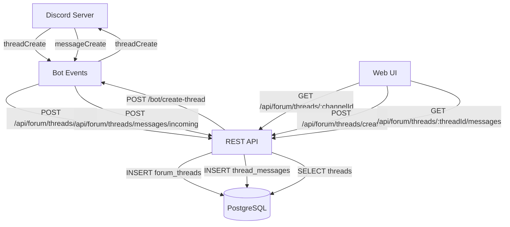

# Correccion de Canales Foro con Soporte de Threads

## Problema Identificado

La implementacion actual trata los canales foro como canales de texto normales:

1. **[bot/src/features/channels/events/channelSync.ts](bot/src/features/channels/events/channelSync.ts) linea 60**: Intenta sincronizar mensajes directos de canales foro (imposible)
2. **UI permite enviar mensajes**: [web/src/pages/ChannelsPage.tsx](web/src/pages/ChannelsPage.tsx) permite chatear en canales foro
3. **No hay gestion de threads**: El sistema no reconoce ni maneja threads

**Arquitectura Discord:**
```
Canal Texto → Mensajes
Canal Foro → Threads → Mensajes (dentro de cada thread)
```

Los canales foro son `ThreadOnlyChannel` en discord.js - solo contienen threads (hilos), NO mensajes directos.

## Flujo de Datos Propuesto



## 1. Base de Datos

**Nueva migracion: `database/migrations/013_forum_threads.sql`**

### Tabla `forum_threads`

Almacena threads de canales foro:

```sql
CREATE TABLE IF NOT EXISTS forum_threads (
  id SERIAL PRIMARY KEY,
  discord_thread_id VARCHAR(255) UNIQUE NOT NULL,
  channel_id INTEGER REFERENCES channels(id) ON DELETE CASCADE,
  name VARCHAR(255) NOT NULL,
  owner_id VARCHAR(255) NOT NULL,
  owner_name VARCHAR(255) NOT NULL,
  archived BOOLEAN DEFAULT false,
  locked BOOLEAN DEFAULT false,
  message_count INTEGER DEFAULT 0,
  created_at TIMESTAMP DEFAULT NOW(),
  updated_at TIMESTAMP DEFAULT NOW()
);

CREATE INDEX idx_forum_threads_channel_id ON forum_threads(channel_id);
CREATE INDEX idx_forum_threads_archived ON forum_threads(archived);
```

### Tabla `thread_messages`

Mensajes dentro de threads de foro:

```sql
CREATE TABLE IF NOT EXISTS thread_messages (
  id SERIAL PRIMARY KEY,
  thread_id INTEGER REFERENCES forum_threads(id) ON DELETE CASCADE,
  discord_message_id VARCHAR(255) UNIQUE NOT NULL,
  author_id VARCHAR(255) NOT NULL,
  author_name VARCHAR(255) NOT NULL,
  author_avatar VARCHAR(500),
  content TEXT NOT NULL,
  mentions TEXT[],
  sent_at TIMESTAMP DEFAULT NOW(),
  edited_at TIMESTAMP,
  deleted_at TIMESTAMP
);

CREATE INDEX idx_thread_messages_thread_id ON thread_messages(thread_id);
CREATE INDEX idx_thread_messages_sent_at ON thread_messages(sent_at DESC);
```

## 2. Bot - Discord.js

### 2.1 Corregir Sincronizacion de Canales

**[bot/src/features/channels/events/channelSync.ts](bot/src/features/channels/events/channelSync.ts)**

Modificar `syncAllChannels()` para NO intentar sincronizar mensajes de canales foro:

```typescript
// Linea 54-67: Cambiar logica
for (const channelId of channelIds) {
  const ch = await client.channels.fetch(channelId);
  
  // EXCLUIR canales foro de sincronizacion de mensajes
  if (ch && ch.isTextBased() && 'messages' in ch && ch.type !== ChannelType.GuildForum) {
    await syncChannelMessages(client, channelId);
  }
}
```

### 2.2 Evento threadCreate

**Nuevo archivo: `bot/src/features/forums/events/threadSync.ts`**

```typescript
import { Client, ThreadChannel } from 'discord.js';
import axios from 'axios';
import { config } from '../../../config';

export async function syncThreadCreate(thread: ThreadChannel) {
  if (!thread.parent || thread.parent.type !== ChannelType.GuildForum) return;
  
  const payload = {
    discord_thread_id: thread.id,
    discord_channel_id: thread.parentId,
    name: thread.name,
    owner_id: thread.ownerId,
    owner_name: (await thread.fetchOwner())?.user?.tag || 'Unknown',
    archived: thread.archived,
    locked: thread.locked,
    message_count: thread.messageCount || 0
  };
  
  await axios.post(`${config.apiUrl}/api/forum/threads/sync`, payload);
}

export async function syncAllThreads(client: Client) {
  for (const [, guild] of client.guilds.cache) {
    for (const [, channel] of guild.channels.cache) {
      if (channel.type !== ChannelType.GuildForum) continue;
      
      // Fetch active threads
      const activeThreads = await channel.threads.fetchActive();
      for (const [, thread] of activeThreads.threads) {
        await syncThreadCreate(thread);
        await syncThreadMessages(client, thread.id);
      }
    }
  }
}
```

### 2.3 Sincronizacion de Mensajes de Threads

**Nuevo archivo: `bot/src/features/forums/events/threadMessageSync.ts`**

Funcion `syncThreadMessages(threadId)` para sincronizar mensajes de un thread especifico.

### 2.4 Registrar Eventos en bot/src/index.ts

```typescript
import { syncThreadCreate, syncAllThreads } from './features/forums/events/threadSync';

// En ClientReady
client.once(Events.ClientReady, async () => {
  await syncAllChannels(client);
  await syncAllThreads(client); // NUEVO
});

// Evento threadCreate
client.on(Events.ThreadCreate, async (thread) => {
  await syncThreadCreate(thread);
});

// Evento threadUpdate
client.on(Events.ThreadUpdate, async (oldThread, newThread) => {
  await syncThreadCreate(newThread);
});

// MessageCreate: detectar si es mensaje de thread de foro
client.on(Events.MessageCreate, async (message) => {
  if (message.channel.isThread() && message.channel.parent?.type === ChannelType.GuildForum) {
    await axios.post(`${config.apiUrl}/api/forum/threads/messages/incoming`, {
      discord_thread_id: message.channel.id,
      discord_message_id: message.id,
      author_id: message.author.id,
      author_name: message.author.tag,
      author_avatar: message.author.displayAvatarURL(),
      content: message.content,
      mentions: message.mentions.users.map(u => u.id)
    });
  }
});
```

### 2.5 Endpoint HTTP: Crear Thread

**[bot/src/index.ts](bot/src/index.ts)** - Agregar endpoint:

```typescript
botHttpServer.post('/create-forum-thread', async (req, res) => {
  const { channelId, name, content, appliedTags } = req.body;
  
  const channel = await client.channels.fetch(channelId);
  if (!channel || channel.type !== ChannelType.GuildForum) {
    return res.status(400).json({ error: 'Canal no es un foro' });
  }
  
  const thread = await channel.threads.create({
    name,
    message: { content },
    appliedTags: appliedTags || []
  });
  
  res.json({ discord_thread_id: thread.id });
});
```

## 3. API Backend

### 3.1 Modelos TypeScript

**Nuevo archivo: `api/src/features/forums/models/ForumThread.ts`**

Interface y metodos CRUD:
- `getByChannel(channelId): Promise<ForumThread[]>`
- `getById(id): Promise<ForumThread | null>`
- `upsert(data): Promise<ForumThread>`
- `updateArchived(threadId, archived): Promise<void>`

**Nuevo archivo: `api/src/features/forums/models/ThreadMessage.ts`**

Metodos similares a [api/src/features/channels/models/ChannelMessage.ts](api/src/features/channels/models/ChannelMessage.ts) pero para threads.

### 3.2 Rutas API

**Nuevo archivo: `api/src/features/forums/routes/forumRoutes.ts`**

Endpoints:
- `POST /api/forum/threads/sync` - Sincronizar thread desde bot (sin auth)
- `GET /api/forum/threads/:channelId` - Listar threads de un canal foro
- `GET /api/forum/threads/:threadId/messages` - Mensajes de un thread
- `POST /api/forum/threads/create` - Crear nuevo thread (llama al bot)
- `POST /api/forum/threads/messages/incoming` - Mensaje entrante desde bot (sin auth)

Registrar en [api/src/index.ts](api/src/index.ts):
```typescript
import forumRoutes from './features/forums/routes/forumRoutes';
app.use('/api/forum', forumRoutes);
```

### 3.3 Servicio

**Nuevo archivo: `api/src/features/forums/services/forumService.ts`**

Logica para comunicacion con bot:
```typescript
static async createThread(channelId: string, name: string, content: string) {
  const response = await axios.post(`${BOT_URL}/create-forum-thread`, {
    channelId, name, content
  });
  return response.data.discord_thread_id;
}
```

## 4. Frontend Web

### 4.1 Tipos TypeScript

**Nuevo archivo: `web/src/types/ForumThread.ts`**

```typescript
export interface ForumThread {
  id: number;
  discord_thread_id: string;
  channel_id: number;
  name: string;
  owner_id: string;
  owner_name: string;
  archived: boolean;
  locked: boolean;
  message_count: number;
  created_at: string;
  updated_at: string;
}

export interface ThreadMessage {
  id: number;
  thread_id: number;
  discord_message_id: string;
  author_id: string;
  author_name: string;
  author_avatar: string | null;
  content: string;
  mentions: string[] | null;
  sent_at: string;
  edited_at: string | null;
  deleted_at: string | null;
}
```

### 4.2 Actualizacion API Service

**[web/src/services/api.ts](web/src/services/api.ts)** - Agregar metodos:

```typescript
// Forum threads
getForumThreads(channelId: number): Promise<ForumThread[]>
getThreadMessages(threadId: number): Promise<ThreadMessage[]>
createForumThread(channelId: number, name: string, content: string): Promise<void>
sendThreadMessage(threadId: number, content: string, mentions: string[]): Promise<ThreadMessage>
```

### 4.3 Componente Lista de Threads

**Nuevo archivo: `web/src/components/forums/ThreadList.tsx`**

Muestra lista de threads para un canal foro seleccionado:
- Lista de threads con nombre, autor, fecha
- Boton para crear nuevo thread
- Click en thread abre el chat del thread
- Indicadores visuales para threads archivados/bloqueados

### 4.4 Componente Chat de Thread

**Nuevo archivo: `web/src/components/forums/ThreadChat.tsx`**

Similar a [web/src/components/channels/ChannelChat.tsx](web/src/components/channels/ChannelChat.tsx) pero adaptado para threads:
- Mostrar mensajes del thread
- Input para enviar mensajes al thread
- Header con nombre del thread y metadata

### 4.5 Modal Crear Thread

**Nuevo archivo: `web/src/components/forums/CreateThreadModal.tsx`**

Modal para crear nuevo thread en canal foro:
- Input: nombre del thread (requerido)
- Textarea: mensaje inicial (requerido)
- Selector de tags (si el canal tiene tags disponibles)
- Boton crear

### 4.6 Modificar ChannelsPage

**[web/src/pages/ChannelsPage.tsx](web/src/pages/ChannelsPage.tsx)**

Agregar logica condicional al seleccionar canal:

```typescript
const handleSelectChannel = (channel: Channel) => {
  setSelectedChannel(channel);
  
  // Si es canal foro, cargar threads en lugar de mensajes
  if (Number(channel.type) === 15) {
    loadThreads(channel.id);
  }
};
```

Renderizado condicional:

```typescript
{selectedChannel ? (
  <>
    <ChannelHeader channel={selectedChannel} onDeleteChannel={...} />
    
    {Number(selectedChannel.type) === 15 ? (
      // Canal Foro: Mostrar lista de threads
      <div className="flex">
        <ThreadList 
          channelId={selectedChannel.id}
          threads={threads}
          selectedThread={selectedThread}
          onSelectThread={setSelectedThread}
          onCreateThread={() => setIsCreateThreadModalOpen(true)}
        />
        {selectedThread && (
          <ThreadChat
            thread={selectedThread}
            messages={threadMessages}
            onSendMessage={handleSendThreadMessage}
          />
        )}
      </div>
    ) : (
      // Canal Texto Normal: Mostrar chat directo
      <ChannelChat
        channel={selectedChannel}
        messages={messages}
        onSendMessage={handleSendMessage}
        onDeleteMessage={handleDeleteMessage}
        isAdmin
      />
    )}
  </>
) : (
  <EmptyState message="Selecciona un canal" />
)}
```

### 4.7 Icono Visual para Foros

**[web/src/components/channels/ChannelSidebar.tsx](web/src/components/channels/ChannelSidebar.tsx) linea 81**

Ya existe icono diferente para foros (💬), mantener este indicador visual.

## Decisiones de Diseno

1. **Tablas separadas vs unificadas**: Usar `forum_threads` y `thread_messages` separadas de `channels` y `channel_messages` para claridad y facilitar consultas especificas.

2. **No sincronizar mensajes de foros como mensajes directos**: Los canales foro NO tienen mensajes propios, solo sus threads tienen mensajes.

3. **UI de dos niveles**: En canales foro, primero seleccionar thread, luego ver mensajes del thread (similar a Discord).

4. **Reutilizar componentes**: `ThreadChat` sera similar a `ChannelChat` pero conectado a threads.

## Testing

Despues de implementar:
1. Crear canal foro en Discord
2. Crear threads manualmente en Discord
3. Verificar sincronizacion en CRM
4. Crear thread desde CRM
5. Enviar mensajes en thread desde CRM
6. Verificar bidireccionalidad
