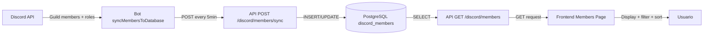

# Plan: Sección de Usuarios y Roles del Servidor Discord

## 1. Base de Datos PostgreSQL

### A. Crear migración SQL

Crear [`api/migrations/008_discord_members.sql`](api/migrations/008_discord_members.sql):

```sql
CREATE TABLE IF NOT EXISTS discord_members (
  id VARCHAR(255) PRIMARY KEY,
  username VARCHAR(255) NOT NULL,
  tag VARCHAR(255) NOT NULL,
  display_name VARCHAR(255) NOT NULL,
  avatar VARCHAR(255),
  joined_at TIMESTAMP,
  created_at TIMESTAMP NOT NULL,
  roles JSONB DEFAULT '[]'::jsonb,
  permissions JSONB DEFAULT '{}'::jsonb,
  updated_at TIMESTAMP DEFAULT CURRENT_TIMESTAMP
);

CREATE INDEX idx_discord_members_username ON discord_members(username);
CREATE INDEX idx_discord_members_roles ON discord_members USING GIN(roles);
```

**Estructura JSONB roles:**
```json
[
  {"id": "123", "name": "Admin", "color": "#FF0000", "position": 10},
  {"id": "456", "name": "Moderator", "color": "#00FF00", "position": 5}
]
```

**Estructura JSONB permissions:**
```json
{
  "administrator": true,
  "manageGuild": false,
  "manageRoles": true,
  "manageChannels": false,
  "kickMembers": false,
  "banMembers": false
}
```

### B. Crear modelo

Crear [`api/src/models/DiscordMemberModel.ts`](api/src/models/DiscordMemberModel.ts) con métodos:
- `upsert(member)` - insertar o actualizar miembro
- `getAll()` - obtener todos los miembros
- `getById(id)` - obtener miembro por ID
- `getRoles()` - obtener lista única de roles
- `getStats()` - estadísticas (total, roles más comunes)

## 2. Modificaciones en el Bot Discord

Actualizar [`bot/src/index.ts`](bot/src/index.ts) - renombrar `updateMembersCache` a `syncMembersToDatabase` y cambiar lógica:

**Capturar información completa:**
- Roles: nombre, color (hexadecimal), posición
- Permisos del miembro (administrator, manageGuild, etc.)
- Fecha de creación de la cuenta Discord (`user.createdAt`)

**Guardar en PostgreSQL vía API:**

```typescript
const syncMembersToDatabase = async () => {
  try {
    const guilds = client.guilds.cache;
    
    for (const [, guild] of guilds) {
      const members = await guild.members.fetch();
      
      for (const [, member] of members) {
        if (member.user.bot) continue;
        
        const memberData = {
          id: member.id,
          username: member.user.username,
          tag: member.user.tag,
          displayName: member.displayName,
          avatar: member.user.avatar,
          joinedAt: member.joinedAt?.toISOString() || null,
          createdAt: member.user.createdAt.toISOString(),
          roles: member.roles.cache
            .filter(role => role.id !== guild.id)
            .map(role => ({
              id: role.id,
              name: role.name,
              color: role.hexColor,
              position: role.position
            }))
            .sort((a, b) => b.position - a.position),
          permissions: {
            administrator: member.permissions.has('Administrator'),
            manageGuild: member.permissions.has('ManageGuild'),
            manageRoles: member.permissions.has('ManageRoles'),
            manageChannels: member.permissions.has('ManageChannels'),
            kickMembers: member.permissions.has('KickMembers'),
            banMembers: member.permissions.has('BanMembers')
          }
        };
        
        // POST a API para guardar en BD
        await axios.post(`${config.apiUrl}/api/discord/members/sync`, memberData);
      }
    }
    
    console.log('Miembros sincronizados en base de datos');
  } catch (error) {
    console.error('Error sincronizando miembros:', error);
  }
};
```

**Eliminar archivo JSON cache** - ya no se necesita `.discord-members-cache.json`

## 3. Actualizar API

Reescribir [`api/src/routes/discord.ts`](api/src/routes/discord.ts) para usar PostgreSQL:

**Interfaces TypeScript:**

```typescript
interface DiscordRole {
  id: string;
  name: string;
  color: string;
  position: number;
}

interface MemberPermissions {
  administrator: boolean;
  manageGuild: boolean;
  manageRoles: boolean;
  manageChannels: boolean;
  kickMembers: boolean;
  banMembers: boolean;
}

interface DiscordMember {
  id: string;
  username: string;
  tag: string;
  displayName: string;
  avatar: string | null;
  joinedAt: string;
  createdAt: string;
  roles: DiscordRole[];
  permissions: MemberPermissions;
}
```

**Endpoints:**
- `POST /members/sync` - endpoint para que el bot sincronice (sin auth)
- `GET /members` - obtener todos de PostgreSQL (con auth)
- `GET /members/stats` - estadísticas (con auth)
- `GET /roles` - lista de roles únicos (con auth)

## 4. Frontend Web

### A. Crear servicio API

Crear [`web/src/services/discord.ts`](web/src/services/discord.ts):

```typescript
import axios from 'axios';

export interface DiscordMember {
  id: string;
  username: string;
  tag: string;
  displayName: string;
  avatar: string | null;
  joinedAt: string;
  createdAt: string;
  roles: Array<{
    id: string;
    name: string;
    color: string;
    position: number;
  }>;
  permissions: {
    administrator: boolean;
    manageGuild: boolean;
    manageRoles: boolean;
    manageChannels: boolean;
    kickMembers: boolean;
    banMembers: boolean;
  };
}

export const discordApi = {
  async getMembers(): Promise<DiscordMember[]> {
    const response = await axios.get('/api/discord/members');
    return response.data;
  },
  
  async getRoles(): Promise<Array<{id: string; name: string; color: string}>> {
    const response = await axios.get('/api/discord/roles');
    return response.data;
  }
};
```

### B. Crear página de usuarios

Crear [`web/src/pages/Members.tsx`](web/src/pages/Members.tsx) con:

**Layout:**
- Header con título "Miembros del Servidor"
- Barra de herramientas:
  - Campo de búsqueda (filtra por username, tag, displayName)
  - Dropdown para filtrar por rol
  - Dropdown para ordenar (nombre, fecha ingreso, fecha creación)
  - Indicador de total de miembros

**Tabla de miembros:**
- Columna avatar (imagen circular 40x40px)
- Columna nombre (username + tag + displayName)
- Columna roles (badges con color del rol)
- Columna permisos clave (iconos para admin, manage guild, etc.)
- Columna fecha de ingreso (formato relativo + tooltip absoluto)
- Columna antigüedad cuenta (formato relativo + tooltip absoluto)

**Funcionalidades:**
- Búsqueda en tiempo real (filtrado client-side)
- Filtrado múltiple por roles
- Ordenamiento ascendente/descendente
- Paginación (50 usuarios por página)

**Estilos:**
- Seguir `.cursor/DESIGN.md` (BMW design system)
- Usar tokens de color existentes
- Badges de roles con el color del Discord
- Tabla responsive con scroll horizontal en móvil

### C. Agregar ruta y navegación

**Actualizar [`web/src/main.tsx`](web/src/main.tsx):**

```typescript
import { Members } from './pages/Members';

// Agregar ruta
<Route
  path="/members"
  element={
    <ProtectedRoute>
      <Members />
    </ProtectedRoute>
  }
/>
```

**Actualizar [`web/src/components/Layout.tsx`](web/src/components/Layout.tsx):**

Agregar item de navegación después de "System Logs":

```typescript
{
  name: 'Server Members',
  path: '/members',
  icon: (
    <svg width="20" height="20" viewBox="0 0 24 24" fill="none" stroke="currentColor" strokeWidth="2">
      <path d="M17 21v-2a4 4 0 0 0-4-4H5a4 4 0 0 0-4 4v2" />
      <circle cx="9" cy="7" r="4" />
      <path d="M23 21v-2a4 4 0 0 0-3-3.87" />
      <path d="M16 3.13a4 4 0 0 1 0 7.75" />
    </svg>
  ),
}
```

## 5. Componentes Reutilizables

Crear componentes específicos en `web/src/components/`:

**`RoleBadge.tsx`:**
- Badge con el color del rol de Discord
- Maneja colores oscuros con texto blanco
- Tooltip con info adicional del rol

**`PermissionIcon.tsx`:**
- Iconos para diferentes permisos
- Tooltip explicativo

**`MemberAvatar.tsx`:**
- Muestra avatar de Discord o iniciales
- Maneja URLs de Discord CDN
- Lazy loading

## 6. Diagrama de Flujo de Datos



## Resumen de Archivos a Modificar/Crear

**Base de datos:**
- `api/migrations/008_discord_members.sql` - CREAR tabla

**Crear modelos:**
- `api/src/models/DiscordMemberModel.ts` - CREAR modelo

**Modificar bot:**
- `bot/src/index.ts` - Cambiar de JSON a PostgreSQL, eliminar cache file

**Modificar API:**
- `api/src/routes/discord.ts` - Reescribir para usar BD, agregar endpoint sync

**Frontend crear:**
- `web/src/pages/Members.tsx` - Página principal
- `web/src/services/discord.ts` - Cliente API
- `web/src/components/RoleBadge.tsx` - Badge de rol
- `web/src/components/PermissionIcon.tsx` - Icono de permiso
- `web/src/components/MemberAvatar.tsx` - Avatar de miembro

**Frontend modificar:**
- `web/src/main.tsx` - Agregar ruta
- `web/src/components/Layout.tsx` - Agregar navegación
