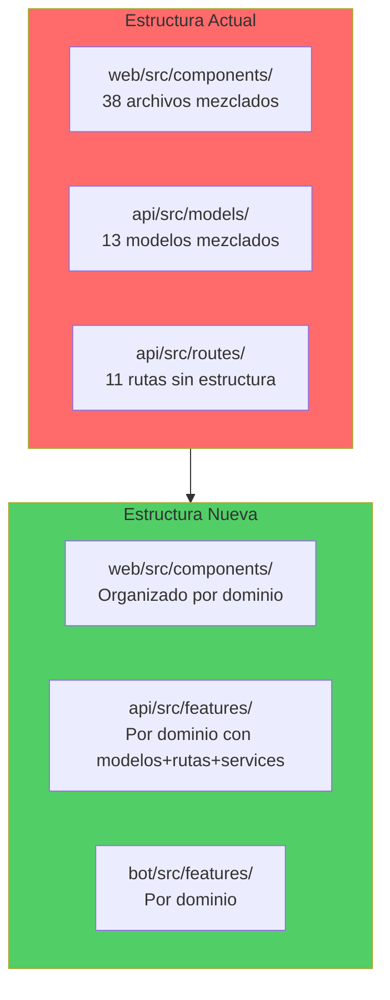

# Plan de Reorganización Estructural del Proyecto

## Análisis de Situación Actual

### Problemas Identificados

**WEB (web/src/):**
- `components/` - 38 componentes sin organización, todos en un nivel
- Mezcla de componentes UI, modales, features específicas
- Componentes duplicados (`ChannelSidebar` + `ChannelSidebarImproved`)

**API (api/src/):**
- `models/` - 13 modelos mezclados sin agrupación por dominio
- `routes/` - 11 archivos de rutas sin estructura clara
- `services/` - Solo 4 servicios para 11 rutas (desbalance)
- Falta de separación por dominios de negocio

**BOT (bot/src/):**
- Estructura básica OK, pero puede mejorarse
- `commands/` está vacío

## Estructura Propuesta

### 1. Frontend (web/src/)

```
web/src/
├── components/
│   ├── ui/                          # Componentes reutilizables
│   │   ├── modals/
│   │   │   ├── ErrorModal.tsx
│   │   │   ├── SuccessModal.tsx
│   │   │   └── ConfirmationModal.tsx
│   │   ├── EmptyState.tsx
│   │   ├── MemberAvatar.tsx
│   │   └── Layout.tsx
│   ├── leads/                       # Dominio CRM
│   │   ├── LeadCard.tsx
│   │   ├── LeadModal.tsx
│   │   ├── CreateLeadForm.tsx
│   │   ├── KanbanColumn.tsx
│   │   ├── StatusPill.tsx
│   │   ├── StatusModal.tsx
│   │   └── ChatModal.tsx
│   ├── channels/                    # Dominio Discord Channels
│   │   ├── ChannelChat.tsx
│   │   ├── ChannelSidebar.tsx       # Consolidar versiones
│   │   ├── ChannelSelector.tsx
│   │   ├── ChannelHeader.tsx
│   │   ├── CategorySelector.tsx
│   │   ├── CategoryList.tsx
│   │   └── modals/
│   │       ├── CreateChannelModal.tsx
│   │       ├── MoveChannelsModal.tsx
│   │       └── ManageCategoriesModal.tsx
│   ├── announcements/               # Dominio Anuncios
│   │   ├── AnnouncementEditor.tsx
│   │   ├── AnnouncementHistory.tsx
│   │   ├── EmbedPreview.tsx
│   │   ├── MemberMentionInput.tsx
│   │   └── modals/
│   │       ├── EditAnnouncementModal.tsx
│   │       └── AnnouncementStatsModal.tsx
│   ├── templates/                   # Dominio Templates
│   │   ├── TemplateManager.tsx
│   │   ├── TemplateSelector.tsx
│   │   └── TemplateList.tsx
│   ├── tickets/                     # Dominio Tickets
│   │   ├── TicketsPanel.tsx
│   │   └── modals/
│   │       └── TicketChatModal.tsx
│   └── roles/                       # Dominio Roles
│       ├── RoleBadge.tsx
│       ├── PermissionIcon.tsx
│       └── modals/
│           ├── RoleModal.tsx
│           └── RoleMembersModal.tsx
├── pages/                           # OK - No cambios
├── services/                        # OK - No cambios
├── types/                           # OK - No cambios
└── context/                         # OK - No cambios
```

### 2. Backend API (api/src/)

```
api/src/
├── features/                        # Organización por dominio
│   ├── leads/
│   │   ├── models/
│   │   │   ├── Lead.ts
│   │   │   └── Message.ts
│   │   ├── routes/
│   │   │   ├── leads.ts
│   │   │   └── messages.ts
│   │   └── services/
│   │       └── leadService.ts      # Crear si no existe
│   ├── channels/
│   │   ├── models/
│   │   │   ├── Channel.ts
│   │   │   └── ChannelMessage.ts
│   │   ├── routes/
│   │   │   ├── channels.ts
│   │   │   └── channelMessages.ts
│   │   └── services/
│   │       └── channelService.ts
│   ├── discord/
│   │   ├── models/
│   │   │   └── DiscordMemberModel.ts
│   │   ├── routes/
│   │   │   ├── discord.ts
│   │   │   └── bot.ts
│   │   └── services/
│   │       └── botService.ts
│   ├── announcements/
│   │   ├── models/
│   │   │   ├── Announcement.ts
│   │   │   ├── AnnouncementCategory.ts
│   │   │   ├── AnnouncementReaction.ts
│   │   │   └── AnnouncementTemplate.ts
│   │   ├── routes/
│   │   │   └── announcements.ts
│   │   ├── services/
│   │   │   └── announcementService.ts
│   │   └── types/
│   │       └── Announcement.ts
│   ├── tickets/
│   │   ├── models/
│   │   │   ├── Ticket.ts
│   │   │   ├── TicketMessage.ts
│   │   │   └── TicketTranscript.ts
│   │   ├── routes/
│   │   │   └── tickets.ts
│   │   └── services/
│   │       └── transcriptService.ts
│   └── auth/
│       ├── routes/
│       │   └── auth.ts
│       └── middleware/
│           └── auth.ts
├── shared/                          # Compartido entre features
│   ├── middleware/
│   │   └── errorHandler.ts
│   ├── utils/
│   │   └── Logger.ts
│   └── database/
│       └── database.ts
├── routes/
│   ├── system.ts
│   └── logs.ts
└── index.ts
```

### 3. Bot Discord (bot/src/)

```
bot/src/
├── features/                        # Por dominio
│   ├── announcements/
│   │   └── events/
│   │       └── announcementReactions.ts
│   ├── channels/
│   │   └── events/
│   │       ├── channelSync.ts
│   │       └── channelMessageSync.ts
│   └── tickets/
│       └── services/
│           └── ticketChannelService.ts
├── commands/                        # Para futuros comandos
└── index.ts
```

## Estrategia de Migración

### Fase 1: Frontend Components
1. Crear nueva estructura de carpetas en `web/src/components/`
2. Mover componentes a sus carpetas correspondientes
3. Actualizar imports en todos los archivos
4. Eliminar `ChannelSidebarImproved` (consolidar con `ChannelSidebar`)
5. Validar que no hay imports rotos

**Archivos afectados:** 38 componentes + todos los archivos que los importan (pages, otros componentes)

### Fase 2: API Models y Routes
1. Crear estructura `features/` en `api/src/`
2. Mover modelos a carpetas por dominio
3. Mover rutas a carpetas por dominio
4. Actualizar imports en routes, services, index.ts
5. Mover middleware y utils a `shared/`
6. Actualizar archivo principal `api/src/index.ts`

**Archivos afectados:** 13 modelos + 11 rutas + 4 services + middleware + utils

### Fase 3: Bot Structure
1. Crear estructura `features/` en `bot/src/`
2. Mover eventos a carpetas por dominio
3. Mover services a carpetas por dominio
4. Actualizar imports en index.ts

**Archivos afectados:** 3 eventos + 1 service

### Fase 4: Validación
1. Ejecutar builds de cada proyecto
2. Verificar que no hay errores de TypeScript
3. Probar funcionalidad crítica
4. Verificar logs

## Diagrama de Reorganización



## Beneficios

1. **Escalabilidad** - Fácil agregar nuevas features
2. **Mantenibilidad** - Rápido localizar código relacionado
3. **Cohesión** - Todo lo relacionado a un dominio junto
4. **Claridad** - Estructura autodocumentada
5. **Trabajo en equipo** - Menos conflictos de merge
6. **Onboarding** - Más fácil entender el proyecto

## Consideraciones

- Migración requiere actualizar MUCHOS imports
- Se debe hacer en una sola sesión o rama dedicada
- Alto riesgo de romper algo si no se valida bien
- Beneficio a largo plazo justifica esfuerzo inicial
- Usar herramientas de refactor automático donde sea posible

## Impacto Estimado

- **Frontend:** ~150-200 archivos con imports a actualizar
- **Backend:** ~50-80 archivos con imports a actualizar  
- **Bot:** ~10-15 archivos con imports a actualizar
- **Total:** ~250-300 archivos a revisar/actualizar
