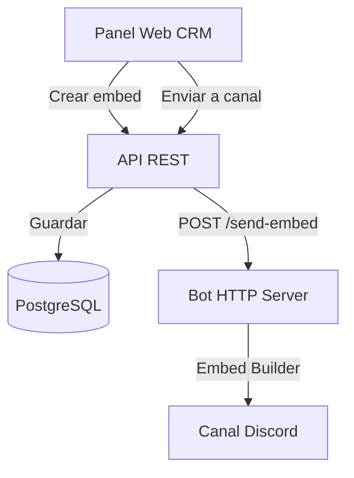

# Sistema de Anuncios con Embeds para Discord

## Arquitectura General



## 1. Base de Datos

Crear nueva tabla `announcements` en [`database/migrations/`](database/migrations/):

```sql
CREATE TABLE announcements (
  id SERIAL PRIMARY KEY,
  title VARCHAR(256),
  description TEXT,
  color VARCHAR(7),           -- Hex color #000000
  thumbnail_url TEXT,
  image_url TEXT,
  footer_text VARCHAR(256),
  footer_icon_url TEXT,
  author_name VARCHAR(256),
  author_icon_url TEXT,
  url TEXT,
  created_by VARCHAR(100),
  created_at TIMESTAMP DEFAULT NOW()
);
```

## 2. Backend API

### Rutas ([`api/src/routes/announcements.ts`](api/src/routes/announcements.ts))

- `POST /api/announcements` - Crear anuncio
- `GET /api/announcements` - Listar anuncios
- `GET /api/announcements/:id` - Obtener anuncio específico
- `POST /api/announcements/:id/send` - Enviar anuncio a canal

**Request body para envío:**
```json
{
  "channelId": "1234567890",
  "embedData": {
    "title": "...",
    "description": "...",
    "color": "#3498db"
  }
}
```

### Modelo ([`api/src/models/Announcement.ts`](api/src/models/Announcement.ts))

CRUD básico para interactuar con la tabla `announcements`.

### Servicio ([`api/src/services/announcementService.ts`](api/src/services/announcementService.ts))

Lógica para enviar embeds al bot:
- Transformar datos del embed al formato de discord.js
- Llamar al endpoint `/send-embed` del bot HTTP server

## 3. Bot de Discord

### Endpoint HTTP ([`bot/src/index.ts`](bot/src/index.ts))

Agregar nuevo endpoint POST `/send-embed`:

```typescript
botHttpServer.post('/send-embed', async (req, res) => {
  const { channelId, embedData } = req.body;
  
  // Validaciones
  // Construir embed con EmbedBuilder
  // Enviar a canal
  // Retornar messageId
});
```

**Implementación:**
- Usar `EmbedBuilder` de discord.js
- Validar que el canal existe y es de texto
- Soportar todos los campos del embed (title, description, color, image, thumbnail, footer, author, url)

## 4. Frontend Web

### Dependencia: embed-visualizer

```bash
npm i embed-visualizer
```

Librería React actualizada (2025) para preview de embeds Discord con soporte completo de markdown.

### Nueva Página: Anuncios ([`web/src/pages/Announcements.tsx`](web/src/pages/Announcements.tsx))

Interfaz principal con:
- Editor de embed (formulario)
- Vista previa en vivo del embed usando `embed-visualizer`
- Selector de canal destino
- Botón "Enviar Anuncio"

### Componente Editor ([`web/src/components/AnnouncementEditor.tsx`](web/src/components/AnnouncementEditor.tsx))

Formulario con campos:
- Título (opcional, max 256 chars)
- Descripción (opcional, max 4096 chars, soporte markdown)
- Color (color picker, hex con preview)
- URL del título (opcional)
- Imagen principal (URL, opcional)
- Thumbnail (URL, opcional)
- Footer texto (opcional, max 256 chars)
- Footer icono (URL, opcional)
- Author nombre (opcional, max 256 chars)
- Author icono (URL, opcional)

### Componente Preview ([`web/src/components/EmbedPreview.tsx`](web/src/components/EmbedPreview.tsx))

Wrapper que usa `EmbedVisualizer` de `embed-visualizer`:

```tsx
import { EmbedVisualizer } from 'embed-visualizer'
import 'embed-visualizer/dist/index.css'

<EmbedVisualizer 
  embed={embedData}
  onError={(e) => console.error(e)}
/>
```

Convierte datos del formulario al formato esperado por la librería.

### Selector de Canal ([`web/src/components/ChannelSelector.tsx`](web/src/components/ChannelSelector.tsx))

Dropdown para seleccionar canal destino:
- Cargar lista de canales desde `/api/channels`
- Mostrar solo canales de texto (type: GuildText, GuildAnnouncement)
- Agrupados por categoría si aplica
- Mostrar icono de canal
- **Identificar canales de tickets:** Marcar visualmente canales que empiezan con `ticket-` usando badge/icono distintivo (ej: "TICKET" badge o icono de ticket)
- Opcional: Toggle para filtrar canales de tickets del selector

### Ruta en App ([`web/src/App.tsx`](web/src/App.tsx))

Agregar ruta `/announcements` protegida con `authMiddleware`.

## 5. Identificación de Canales de Tickets

### Backend - Modificar ruta existente ([`api/src/features/channels/routes/channels.ts`](api/src/features/channels/routes/channels.ts))

Modificar el endpoint `GET /api/channels` (línea 12-20) para agregar propiedad `isTicketChannel`:

```typescript
router.get('/', async (req, res, next) => {
  try {
    const channels = await ChannelModel.getAll();
    const enrichedChannels = channels.map(channel => ({
      ...channel,
      isTicketChannel: channel.name.startsWith('ticket-')
    }));
    Logger.info('Canales listados', { count: enrichedChannels.length }, req);
    res.json(enrichedChannels);
  } catch (error) {
    next(error);
  }
});
```

### Actualizar tipo Channel ([`api/src/features/channels/models/Channel.ts`](api/src/features/channels/models/Channel.ts))

Agregar propiedad opcional al tipo (para respuestas API):

```typescript
export interface Channel {
  id: number;
  discord_channel_id: string;
  name: string;
  type: string;
  position: number;
  parent_id: string | null;
  topic: string | null;
  created_at: Date;
  updated_at: Date;
  isTicketChannel?: boolean;  // Agregado para identificación en frontend
}
```

### Frontend ([`web/src/components/ChannelSelector.tsx`](web/src/components/ChannelSelector.tsx))

- Renderizar badge "TICKET" o icono cuando `isTicketChannel === true`
- Estilo visual distintivo (usar tokens de color BMW)
- Opcional: Toggle/checkbox "Ocultar canales de tickets" para filtrado

### Actualizar tipo frontend ([`web/src/types/Channel.ts`](web/src/types/Channel.ts))

Agregar propiedad para identificación:

```typescript
export interface Channel {
  id: number;
  discord_channel_id: string;
  name: string;
  type: string;
  position: number;
  parent_id: string | null;
  topic: string | null;
  created_at: string;
  updated_at: string;
  isTicketChannel?: boolean;  // Agregado para identificación visual
}
```

## 6. Tipos TypeScript

### Backend ([`api/src/types/Announcement.ts`](api/src/types/Announcement.ts))

```typescript
interface AnnouncementEmbed {
  title?: string;
  description?: string;
  color?: string;
  url?: string;
  thumbnail_url?: string;
  image_url?: string;
  footer_text?: string;
  footer_icon_url?: string;
  author_name?: string;
  author_icon_url?: string;
}
```

### Frontend ([`web/src/types/Announcement.ts`](web/src/types/Announcement.ts))

Mismos tipos para mantener consistencia.

## Flujo de Usuario

1. Admin accede a `/announcements`
2. Completa campos del embed en el editor
3. Ve preview en tiempo real mientras escribe
4. Selecciona canal destino
5. Click en "Enviar Anuncio"
6. Sistema guarda en BD y envía al bot
7. Bot envía embed al canal de Discord
8. Confirmación en UI

## Diseño UI

Seguir especificaciones de [`.cursor/DESIGN.md`](.cursor/DESIGN.md):
- Colores BMW: grises corporativos, azul acento
- Tipografía: BMW Type
- Componentes: inputs, buttons, cards según design system
- Layout: grid de 2 columnas (editor | preview)

## Validaciones

- Limites de caracteres Discord (título 256, descripción 4096)
- URLs válidas para imágenes
- Color en formato hex válido (#RRGGBB)
- Canal seleccionado debe existir

## Logging

Usar [`Logger`](api/src/utils/Logger.ts) para:
- Creación de anuncios
- Envío exitoso/fallido
- Errores de validación
