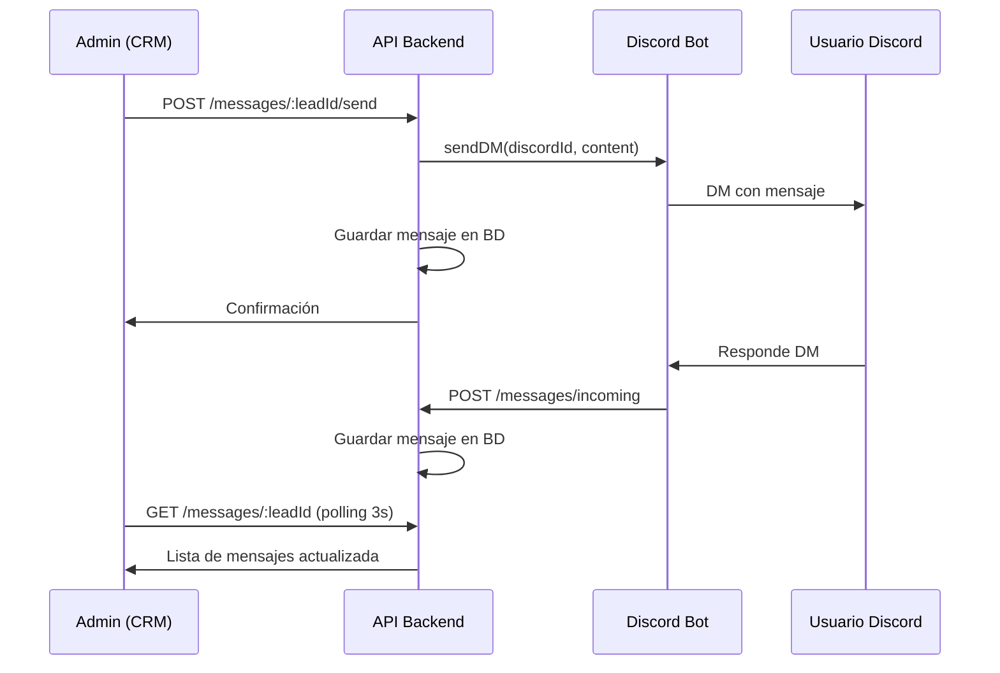

# Sistema de Conversaciones CRM - Discord DM

## 1. Base de Datos - Nueva tabla de mensajes

Crear migración `003_conversations.sql`:

```sql
CREATE TABLE IF NOT EXISTS messages (
  id SERIAL PRIMARY KEY,
  lead_id INTEGER REFERENCES leads(id) ON DELETE CASCADE,
  discord_message_id VARCHAR(100),
  content TEXT NOT NULL,
  sender_type VARCHAR(20) NOT NULL CHECK (sender_type IN ('admin', 'user')),
  sender_name VARCHAR(255),
  sent_at TIMESTAMP DEFAULT NOW(),
  read_at TIMESTAMP,
  error TEXT
);

CREATE INDEX idx_messages_lead_id ON messages(lead_id);
CREATE INDEX idx_messages_sent_at ON messages(sent_at DESC);
```

Almacenará mensajes del CRM (admin) y del usuario (Discord DM).

## 2. Bot Discord - Habilitar procesamiento de mensajes DM

**Modificar [`bot/src/index.ts`](bot/src/index.ts):**

- Añadir intents de mensajes:

```typescript
intents: [
  GatewayIntentBits.Guilds,
  GatewayIntentBits.GuildMembers,
  GatewayIntentBits.DirectMessages,
  GatewayIntentBits.MessageContent,
],
partials: [Partials.Channel, Partials.Message]
```

- Añadir listener de mensajes DM:

```typescript
client.on(Events.MessageCreate, async (message) => {
  if (message.author.bot) return;
  if (message.channel.type !== ChannelType.DM) return;
  
  // Buscar lead por discord_id y guardar mensaje en BD via API
  await axios.post(`${config.apiUrl}/api/messages/incoming`, {
    discord_id: message.author.id,
    content: message.content,
    discord_message_id: message.id,
    sender_name: message.author.tag
  });
});
```

- Crear función para enviar DM desde el bot:

```typescript
export async function sendDMToLead(discordId: string, content: string) {
  const user = await client.users.fetch(discordId);
  const dmChannel = await user.createDM();
  const message = await dmChannel.send(content);
  return message.id;
}
```

## 3. API - Endpoints de mensajería

**Crear [`api/src/routes/messages.ts`](api/src/routes/messages.ts):**

- `POST /api/messages/incoming` - Webhook del bot para DM entrantes (sin auth)
- `GET /api/messages/:leadId` - Obtener mensajes de un lead (con auth)
- `POST /api/messages/:leadId/send` - Enviar mensaje desde CRM (con auth)
- `GET /api/messages/:leadId/unread` - Contador de no leídos
- `PATCH /api/messages/:leadId/mark-read` - Marcar como leído

**Crear [`api/src/models/Message.ts`](api/src/models/Message.ts):**

```typescript
export class MessageModel {
  static async create(data: MessageData)
  static async getByLeadId(leadId: number, limit = 100)
  static async getUnreadCount(leadId: number)
  static async markAsRead(leadId: number)
}
```

**Endpoint `/api/messages/:leadId/send`:**

```typescript
router.post('/:leadId/send', async (req, res) => {
  const { content, sender_name } = req.body;
  const lead = await LeadModel.getById(leadId);
  
  // Guardar mensaje en BD
  const message = await MessageModel.create({
    lead_id: leadId,
    content,
    sender_type: 'admin',
    sender_name
  });
  
  // Enviar DM via bot
  try {
    const discordMessageId = await botService.sendDM(lead.discord_id, content);
    await MessageModel.updateDiscordId(message.id, discordMessageId);
  } catch (error) {
    await MessageModel.markError(message.id, error.message);
  }
  
  res.json(message);
});
```

**Crear [`api/src/services/botService.ts`](api/src/services/botService.ts):**

Expondrá función para que la API llame al bot y envíe DM (comunicación vía endpoint HTTP del bot o evento).

## 4. Frontend - Modal de conversaciones

**Crear [`web/src/components/ChatModal.tsx`](web/src/components/ChatModal.tsx):**

- Modal fullscreen o grande (80% viewport)
- Layout: cabecera con info del lead, área de mensajes, input de envío
- Polling cada 3 segundos para nuevos mensajes (`api.getMessages(leadId)`)
- Mostrar mensajes con diferenciación visual (admin/user)
- Auto-scroll al último mensaje
- Indicador de mensajes no leídos
- Manejo de errores de envío

**Estructura:**

```tsx
export function ChatModal({ lead, onClose }: ChatModalProps) {
  const [messages, setMessages] = useState([]);
  const [newMessage, setNewMessage] = useState('');
  const [loading, setLoading] = useState(false);
  
  useEffect(() => {
    loadMessages();
    const interval = setInterval(loadMessages, 3000);
    return () => clearInterval(interval);
  }, [lead.id]);
  
  const loadMessages = async () => {
    const data = await api.getMessages(lead.id);
    setMessages(data);
    await api.markMessagesRead(lead.id);
  };
  
  const handleSend = async () => {
    await api.sendMessage(lead.id, newMessage, 'Admin');
    setNewMessage('');
    loadMessages();
  };
  
  // UI con lista de mensajes, input y botón enviar
}
```

**Actualizar [`web/src/services/api.ts`](web/src/services/api.ts):**

```typescript
getMessages: (leadId: number) => get(`/api/messages/${leadId}`),
sendMessage: (leadId: number, content: string, sender: string) => 
  post(`/api/messages/${leadId}/send`, { content, sender_name: sender }),
markMessagesRead: (leadId: number) => 
  patch(`/api/messages/${leadId}/mark-read`),
getUnreadCount: (leadId: number) => 
  get(`/api/messages/${leadId}/unread`)
```

## 5. Integración en LeadModal

**Modificar [`web/src/components/LeadModal.tsx`](web/src/components/LeadModal.tsx):**

- Añadir estado `showChat: boolean`
- Añadir botón "Conversar" en la cabecera (al lado del botón cerrar)
- Renderizar `ChatModal` condicionalmente cuando `showChat === true`
- Mostrar badge con contador de mensajes no leídos

```tsx
const [showChat, setShowChat] = useState(false);
const [unreadCount, setUnreadCount] = useState(0);

// Cargar contador no leídos
useEffect(() => {
  if (lead.discord_id) {
    api.getUnreadCount(lead.id).then(setUnreadCount);
  }
}, [lead.id]);

// Botón en la cabecera
<button onClick={() => setShowChat(true)}>
  Conversar {unreadCount > 0 && `(${unreadCount})`}
</button>

// Renderizar modal
{showChat && (
  <ChatModal lead={lead} onClose={() => {
    setShowChat(false);
    setUnreadCount(0);
  }} />
)}
```

## 6. Variables de entorno

**Bot [`bot/.env`](bot/.env):**

```
DISCORD_TOKEN=...
API_URL=http://localhost:3001
ADMIN_CHANNEL_ID=...
BOT_HTTP_PORT=3002  # Para recibir comandos de API
```

## Flujo completo



## Consideraciones técnicas

- Solo funciona con leads que tengan `discord_id` (auto-capturados o manualmente asignados)
- Mostrar mensaje en UI si lead no tiene discord_id
- Logging de errores cuando DM falla (usuario bloqueó DMs)
- Límite de caracteres Discord: 2000
- Rate limits de Discord: 5 DM por segundo
- Mensajes guardados en BD aunque falle envío (para retry manual)
