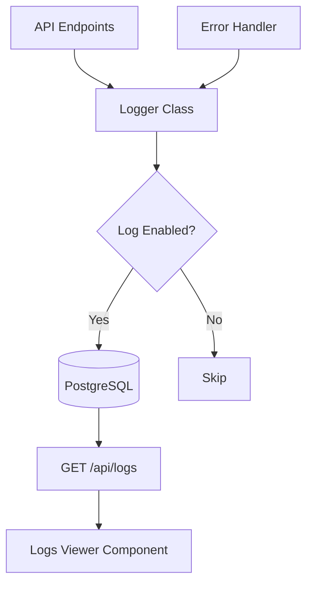

# Sistema de Logging para CRM

## Arquitectura



## Base de Datos

**Nueva migración**: [`database/migrations/002_logs.sql`](database/migrations/002_logs.sql)

```sql
CREATE TABLE system_logs (
  id SERIAL PRIMARY KEY,
  level VARCHAR(20) CHECK (level IN ('error', 'warning', 'info', 'debug')),
  message TEXT NOT NULL,
  context JSONB,
  stack_trace TEXT,
  user_id VARCHAR(100),
  endpoint VARCHAR(255),
  method VARCHAR(10),
  ip_address VARCHAR(45),
  created_at TIMESTAMP DEFAULT NOW()
);

CREATE INDEX idx_logs_level ON system_logs(level);
CREATE INDEX idx_logs_created_at ON system_logs(created_at DESC);
```

## Clase Logger

**Archivo nuevo**: [`api/src/utils/Logger.ts`](api/src/utils/Logger.ts)

Funcionalidades:
- Métodos: `error()`, `warning()`, `info()`, `debug()`
- Singleton pattern para instancia única
- Control de activación vía variable de entorno `ENABLE_LOGGING`
- Niveles configurables vía `LOG_LEVEL`
- Inserción asíncrona en PostgreSQL
- Captura automática de contexto (endpoint, método HTTP, IP)

Ejemplo de uso:
```typescript
Logger.error('Error procesando lead', { leadId: 123 }, error);
Logger.info('Lead creado exitosamente', { leadId: 456 });
```

## Integración con Express

**Modificar**: [`api/src/middleware/errorHandler.ts`](api/src/middleware/errorHandler.ts)
- Integrar Logger para registrar todos los errores automáticamente
- Mantener respuestas HTTP actuales

**Modificar**: [`api/src/routes/leads.ts`](api/src/routes/leads.ts)
- Agregar logging en operaciones críticas (create, update, delete)
- Log de errores específicos de negocio

## API de Logs

**Archivo nuevo**: [`api/src/routes/logs.ts`](api/src/routes/logs.ts)

Endpoints:
- `GET /api/logs` - Lista logs con paginación y filtros
  - Query params: `level`, `limit`, `offset`, `startDate`, `endDate`
- `GET /api/logs/stats` - Estadísticas de logs (conteo por nivel)
- `DELETE /api/logs/cleanup` - Limpiar logs antiguos (admin)

**Modificar**: [`api/src/index.ts`](api/src/index.ts)
- Registrar nueva ruta `/api/logs` con autenticación

## Frontend - Visor de Logs

**Archivo nuevo**: [`web/src/pages/Logs.tsx`](web/src/pages/Logs.tsx)

Componentes:
- Tabla con logs filtrados por nivel
- Selector de nivel (Error/Warning/Info/Debug)
- Paginación
- Selector de rango de fechas
- Modal para ver detalles completos (stack trace, context)
- Indicadores visuales por nivel (colores)

**Archivo nuevo**: [`web/src/services/logs.ts`](web/src/services/logs.ts)
- Cliente API para consumir endpoints de logs

**Modificar**: [`web/src/App.tsx`](web/src/App.tsx)
- Agregar ruta `/logs` con protección de autenticación

## Configuración

**Modificar**: [`api/.env`](api/.env)
```
ENABLE_LOGGING=true
LOG_LEVEL=info
LOG_RETENTION_DAYS=90
```

Niveles jerárquicos:
- `error` - Solo errores
- `warning` - Errores + advertencias  
- `info` - Errores + advertencias + info (recomendado producción)
- `debug` - Todo (solo desarrollo)

## Casos de Uso

1. **Error de servidor**: Captura automática vía errorHandler
2. **Operaciones de negocio**: Log manual en rutas críticas
3. **Auditoría**: Rastrear quién modificó qué y cuándo
4. **Debugging**: Logs de nivel debug desactivados en producción
5. **Monitoreo**: Dashboard de logs para detectar patrones de error

## Consideraciones

- Los logs se almacenan de forma asíncrona para no bloquear requests
- Implementar rotación/limpieza automática de logs antiguos
- Logs sensibles (passwords, tokens) nunca se almacenan
- El sistema funciona sin logging si está desactivado (no afecta performance)
