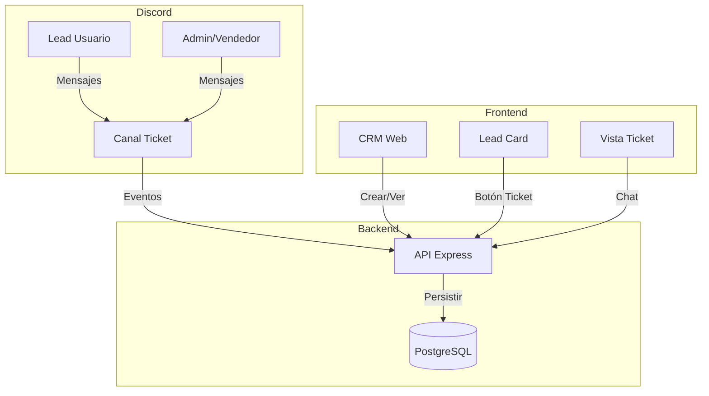

# Plan: Sistema de Tickets para CRM Discord Bot

## Contexto

El sistema actual usa DMs para comunicación con leads. Los tickets agregarán canales privados de Discord para conversaciones estructuradas, manteniendo los DMs para casos informales.

## Arquitectura del Sistema



## 1. Base de Datos

### Nueva tabla `tickets`

Archivo: [`database/migrations/009_tickets.sql`](database/migrations/009_tickets.sql)

```sql
CREATE TABLE tickets (
  id SERIAL PRIMARY KEY,
  lead_id INTEGER NOT NULL REFERENCES leads(id) ON DELETE CASCADE,
  discord_channel_id VARCHAR(100) UNIQUE NOT NULL,
  status VARCHAR(20) NOT NULL CHECK (status IN ('open', 'closed', 'archived')),
  created_by VARCHAR(100) NOT NULL,
  closed_by VARCHAR(100),
  created_at TIMESTAMP DEFAULT NOW(),
  closed_at TIMESTAMP,
  resolution_notes TEXT
);

CREATE INDEX idx_tickets_lead_id ON tickets(lead_id);
CREATE INDEX idx_tickets_status ON tickets(status);
CREATE INDEX idx_tickets_discord_channel ON tickets(discord_channel_id);
```

### Nueva tabla `ticket_messages`

```sql
CREATE TABLE ticket_messages (
  id SERIAL PRIMARY KEY,
  ticket_id INTEGER NOT NULL REFERENCES tickets(id) ON DELETE CASCADE,
  discord_message_id VARCHAR(100) NOT NULL,
  author_id VARCHAR(100) NOT NULL,
  author_name VARCHAR(255) NOT NULL,
  content TEXT NOT NULL,
  sent_at TIMESTAMP DEFAULT NOW()
);

CREATE INDEX idx_ticket_messages_ticket_id ON ticket_messages(ticket_id);
```

### Nueva tabla `ticket_transcripts`

```sql
CREATE TABLE ticket_transcripts (
  id SERIAL PRIMARY KEY,
  ticket_id INTEGER NOT NULL REFERENCES tickets(id) ON DELETE CASCADE,
  pdf_url TEXT NOT NULL,
  message_count INTEGER NOT NULL,
  duration_minutes INTEGER,
  participants TEXT[],
  generated_at TIMESTAMP DEFAULT NOW()
);
```

## 2. API Backend

### Modelos TypeScript

**[`api/src/models/Ticket.ts`](api/src/models/Ticket.ts)**

```typescript
interface Ticket {
  id: number;
  lead_id: number;
  discord_channel_id: string;
  status: 'open' | 'closed' | 'archived';
  created_by: string;
  closed_by?: string;
  created_at: Date;
  closed_at?: Date;
  resolution_notes?: string;
}
```

Métodos principales:
- `create(leadId, channelId, createdBy)`
- `getByLeadId(leadId)`
- `getById(id)`
- `close(id, closedBy, notes)`
- `updateStatus(id, status)`
- `getMetrics()` - estadísticas agregadas

**[`api/src/models/TicketMessage.ts`](api/src/models/TicketMessage.ts)**

Siguiendo el patrón de [`api/src/models/ChannelMessage.ts`](api/src/models/ChannelMessage.ts).

### Rutas API

**[`api/src/routes/tickets.ts`](api/src/routes/tickets.ts)**

- `POST /api/tickets/create` - Crear ticket (requiere `lead_id`)
- `GET /api/tickets/:leadId` - Listar tickets de un lead
- `GET /api/tickets/:ticketId/messages` - Mensajes del ticket
- `POST /api/tickets/:ticketId/close` - Cerrar ticket + generar PDF
- `POST /api/tickets/:ticketId/transfer` - Transferir a otro vendedor
- `POST /api/tickets/messages/incoming` - Webhook desde bot (sin auth)
- `GET /api/tickets/metrics` - Estadísticas globales

Registrar en [`api/src/index.ts`](api/src/index.ts):
```typescript
app.use('/api/tickets', ticketRoutes);
```

### Servicio de Transcripciones

**[`api/src/services/transcriptService.ts`](api/src/services/transcriptService.ts)**

Usar librería `pdfkit` para generar PDFs:

```typescript
async generateTranscript(ticketId: number): Promise<string>
```

Flujo:
1. Obtener ticket + lead + mensajes
2. Generar PDF con diseño BMW (según [`docs/DESIGN.md`](docs/DESIGN.md))
3. Guardar en `api/transcripts/` o usar servicio de almacenamiento
4. Insertar registro en `ticket_transcripts`
5. Retornar URL del PDF

## 3. Bot Discord

### Comandos Slash

**Nuevo archivo: [`bot/src/commands/ticket.ts`](bot/src/commands/ticket.ts)**

Implementar comandos:
- `/ticket create <lead_name>` - Crear ticket manual
- `/ticket close [resolution_notes]` - Cerrar ticket desde Discord
- `/ticket transfer <user>` - Transferir a otro vendedor

Registrar comandos usando `SlashCommandBuilder` y REST API de Discord.

**Nuevo archivo: [`bot/src/deploy-commands.ts`](bot/src/deploy-commands.ts)**

Script para registrar comandos en Discord Application.

### Gestión de Canales

**[`bot/src/services/ticketChannelService.ts`](bot/src/services/ticketChannelService.ts)**

```typescript
async createTicketChannel(leadName: string, leadDiscordId: string, assignedTo?: string)
async closeTicketChannel(channelId: string)
async updateChannelPermissions(channelId: string, userId: string, allow: boolean)
```

Permisos del canal:
- Lead (por `discord_id`)
- Admins (rol `Administrator` o configurado)
- Usuario asignado (desde `leads.assigned_to` si es Discord user ID)

Estructura:
- Categoría `TICKETS` para tickets abiertos
- Categoría `TICKETS-ARCHIVO` para cerrados
- Nombre canal: `ticket-{leadName}-{numero}`

### Eventos de Mensajes

**Modificar [`bot/src/index.ts`](bot/src/index.ts)**

En el listener `MessageCreate` existente, agregar lógica:

```typescript
if (message.channel.type === ChannelType.GuildText) {
  // Verificar si el canal es un ticket
  if (message.channel.name.startsWith('ticket-')) {
    // POST a /api/tickets/messages/incoming
  }
}
```

Sincronizar mensajes de tickets a la base de datos (similar a como se hace con `channel_messages`).

### Endpoint HTTP en Bot

**Modificar [`bot/src/index.ts`](bot/src/index.ts)**

Agregar endpoints:
- `POST /create-ticket` - Crear canal + configurar permisos
- `POST /close-ticket` - Archivar canal
- `POST /transfer-ticket` - Actualizar permisos

## 4. Frontend Web

### Servicios API

**[`web/src/services/api.ts`](web/src/services/api.ts)**

Agregar métodos siguiendo el patrón existente:

```typescript
createTicket(leadId: number)
getTickets(leadId: number)
getTicketMessages(ticketId: number)
closeTicket(ticketId: number, notes?: string)
transferTicket(ticketId: number, userId: string)
getTicketMetrics()
```

### Componentes UI

**[`web/src/components/TicketsPanel.tsx`](web/src/components/TicketsPanel.tsx)**

Panel dentro de `LeadModal` que muestra:
- Botón "Abrir Ticket" (si no hay tickets abiertos)
- Lista de tickets existentes (abiertos/cerrados)
- Badges de estado
- Acceso a transcripciones PDF

**[`web/src/components/TicketChatModal.tsx`](web/src/components/TicketChatModal.tsx)**

Similar a [`ChatModal.tsx`](web/src/components/ChatModal.tsx), pero para tickets:
- Timeline de mensajes del ticket
- Envío de mensajes (via bot, no DM directo)
- Botones: Cerrar, Transferir, Ver Transcripción
- Polling cada 3s para mensajes nuevos

**Modificar [`web/src/components/LeadCard.tsx`](web/src/components/LeadCard.tsx)**

Agregar badge visual si el lead tiene tickets abiertos (icono o contador).

**Modificar [`web/src/components/LeadModal.tsx`](web/src/components/LeadModal.tsx)**

Agregar pestaña o sección "Tickets" que renderice `TicketsPanel`.

### Página de Métricas

**[`web/src/pages/TicketMetrics.tsx`](web/src/pages/TicketMetrics.tsx)**

Dashboard con:
- Tiempo promedio de resolución
- Tickets por vendedor
- Tickets por estado
- Gráficos usando librería como `recharts`

Agregar ruta en [`web/src/main.tsx`](web/src/main.tsx).

## 5. Integración y Flujos

### Flujo: Crear Ticket desde Web

1. Usuario hace clic en "Abrir Ticket" en `LeadModal`
2. `api.createTicket(leadId)` → `POST /api/tickets/create`
3. API llama a `BotService.createTicket(...)` → bot HTTP
4. Bot crea canal con permisos y devuelve `channel_id`
5. API inserta registro en `tickets` con `status: 'open'`
6. Frontend actualiza y muestra `TicketChatModal`

### Flujo: Mensaje en Ticket (Discord → DB)

1. Usuario escribe en canal de ticket
2. Bot captura evento `MessageCreate`
3. Bot envía `POST /api/tickets/messages/incoming`
4. API inserta en `ticket_messages`
5. Frontend (polling) muestra mensaje nuevo

### Flujo: Cerrar Ticket

1. Admin hace clic en "Cerrar Ticket" en web
2. `api.closeTicket(ticketId, notes)`
3. API:
   - Llama a `TranscriptService.generateTranscript()`
   - Actualiza `tickets.status = 'closed'`, `closed_at`, `closed_by`
   - Inserta en `ticket_transcripts`
   - Llama a bot para archivar canal
4. Bot mueve canal a categoría `TICKETS-ARCHIVO`

### Flujo: Transferir Ticket

1. Admin selecciona nuevo vendedor en web
2. API actualiza `leads.assigned_to`
3. API llama a bot para actualizar permisos del canal
4. Bot añade permiso al nuevo usuario, remueve al anterior

## 6. Dependencias Nuevas

### Backend
- `pdfkit` - Generación de PDFs
- `@types/pdfkit`

### Bot
- Actualizar `discord.js` a versión estable más reciente si es necesario
- No requiere nuevas dependencias

### Frontend
- `recharts` - Gráficos para métricas (opcional)

## 7. Consideraciones Técnicas

### Logs
Usar [`Logger`](api/src/utils/Logger.ts) en todas las operaciones:
- Creación de tickets
- Errores al generar transcripciones
- Fallos al crear canales

### Sincronización
Similar al backfill de DMs en [`bot/src/index.ts`](bot/src/index.ts), implementar sync periódico de mensajes de tickets para recuperar mensajes perdidos.

### Permisos Discord
El bot necesita:
- `MANAGE_CHANNELS` - Crear/archivar canales
- `MANAGE_ROLES` - Configurar permisos por canal
- `VIEW_CHANNEL`, `SEND_MESSAGES` en tickets

### Convivencia DMs/Tickets
- Mantener [`ChatModal`](web/src/components/ChatModal.tsx) para DMs
- `LeadModal` tendrá dos pestañas: "Chat Rápido" (DMs) y "Tickets"
- No mezclar `messages` con `ticket_messages`

## 8. Archivos Clave a Crear/Modificar

### Crear:
- `database/migrations/009_tickets.sql`
- `api/src/models/Ticket.ts`
- `api/src/models/TicketMessage.ts`
- `api/src/routes/tickets.ts`
- `api/src/services/transcriptService.ts`
- `bot/src/commands/ticket.ts`
- `bot/src/deploy-commands.ts`
- `bot/src/services/ticketChannelService.ts`
- `web/src/components/TicketsPanel.tsx`
- `web/src/components/TicketChatModal.tsx`
- `web/src/pages/TicketMetrics.tsx`

### Modificar:
- `bot/src/index.ts` - Eventos, endpoints HTTP
- `api/src/index.ts` - Registrar rutas
- `web/src/services/api.ts` - Métodos de tickets
- `web/src/components/LeadCard.tsx` - Badge tickets
- `web/src/components/LeadModal.tsx` - Panel tickets
- `web/src/main.tsx` - Ruta métricas

## 9. Orden de Implementación Recomendado

1. **Base de datos** - Migraciones y modelos
2. **API Backend** - Rutas básicas (crear, listar, cerrar)
3. **Bot Discord** - Comandos slash + gestión de canales
4. **Sincronización** - Eventos de mensajes bot ↔ API
5. **Frontend básico** - Botón crear, lista tickets
6. **Frontend chat** - `TicketChatModal`
7. **Transcripciones** - Generación PDF al cerrar
8. **Métricas** - Dashboard y estadísticas
9. **Refinamiento** - Badges, polling, UX

## 10. Validaciones y Testing

- Validar que `lead.discord_id` existe antes de crear ticket
- Validar permisos al transferir (usuario debe estar en servidor)
- Manejar casos donde bot pierde permisos en Discord
- Testing manual: crear ticket, enviar mensajes, cerrar, ver PDF
