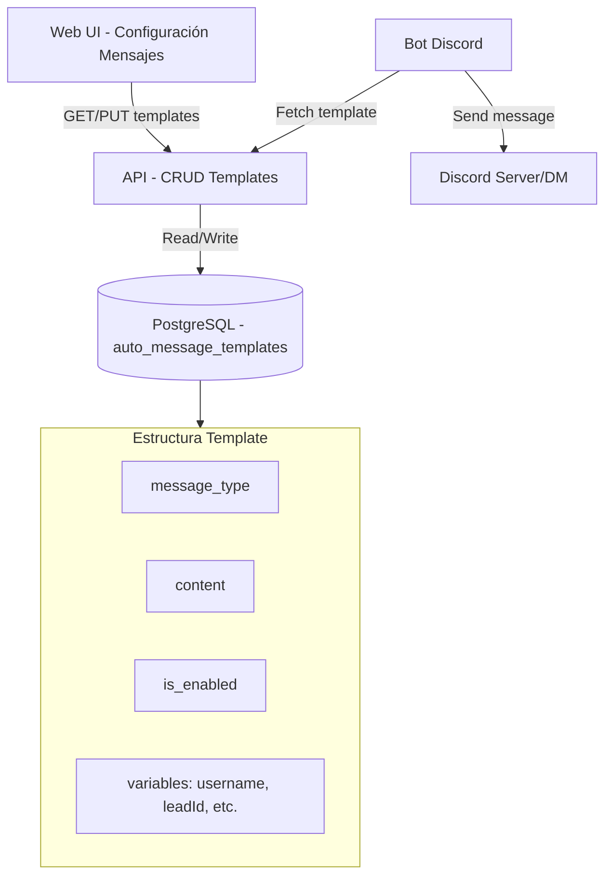

# Plan: Sistema de Gestión de Mensajes Automáticos

## Contexto actual

El bot envía 6 tipos de mensajes automáticos hardcodeados:

**GuildMemberAdd** ([`bot/src/index.ts:349-388`](bot/src/index.ts)):
- DM bienvenida al nuevo miembro
- Notificación admin de nuevo lead
- Notificación admin de error al capturar lead

**Tickets** ([`bot/src/features/tickets/services/ticketChannelService.ts:117-198`](bot/src/features/tickets/services/ticketChannelService.ts)):
- Apertura de ticket
- Cierre de ticket
- Transferencia de ticket

## Arquitectura de la solución



## Base de datos

**Nueva tabla:** `auto_message_templates`

```sql
CREATE TABLE auto_message_templates (
  id SERIAL PRIMARY KEY,
  message_type VARCHAR(50) UNIQUE NOT NULL,
  content TEXT NOT NULL,
  is_enabled BOOLEAN DEFAULT true,
  description TEXT,
  available_variables TEXT[],
  created_at TIMESTAMP DEFAULT CURRENT_TIMESTAMP,
  updated_at TIMESTAMP DEFAULT CURRENT_TIMESTAMP
);
```

**Tipos de mensaje:**
- `welcome_dm` - Bienvenida DM
- `admin_new_lead` - Notificación admin nuevo lead
- `admin_lead_error` - Notificación admin error lead
- `ticket_open` - Apertura ticket
- `ticket_close` - Cierre ticket
- `ticket_transfer` - Transferencia ticket

**Variables dinámicas disponibles por tipo:**
- `welcome_dm`: `{username}`, `{userId}`, `{serverName}`
- `admin_new_lead`: `{username}`, `{userId}`, `{leadId}`, `{date}`
- `admin_lead_error`: `{username}`, `{error}`
- `ticket_open`: `{leadName}`, `{leadId}`
- `ticket_close`: `{channelName}`
- `ticket_transfer`: `{newUserMention}`, `{newUserName}`

## Backend (API)

**Nueva feature:** `api/src/features/autoMessages/`

```
autoMessages/
├── models/
│   └── AutoMessageTemplate.ts
├── services/
│   └── autoMessageService.ts
└── routes/
    └── autoMessages.ts
```

**Endpoints:**
- `GET /api/auto-messages` - Listar todos los templates
- `GET /api/auto-messages/:type` - Obtener template específico
- `PUT /api/auto-messages/:type` - Actualizar template (content, enabled, etc.)
- `POST /api/auto-messages/:type/preview` - Vista previa con variables reemplazadas
- `GET /api/auto-messages/types` - Listar tipos disponibles con metadata

**Servicio clave:** función `renderTemplate(type, variables)` que:
1. Fetch template de BD
2. Reemplaza variables `{variable}` con valores reales
3. Retorna contenido renderizado

## Bot (Discord)

**Refactorizar mensajes hardcodeados:**

Cambiar en [`bot/src/index.ts`](bot/src/index.ts):
```typescript
// Antes (hardcodeado):
await member.send(`¡Bienvenido/a al servidor! 👋\n\n...`);

// Después (desde API):
const template = await fetchTemplate('welcome_dm');
if (template.is_enabled) {
  const message = renderTemplate(template.content, {
    username: member.user.tag,
    userId: member.id,
    serverName: member.guild.name
  });
  await member.send(message);
}
```

**Nuevo servicio del bot:** `bot/src/services/messageTemplateService.ts`
- `fetchTemplate(type)` - Llamada HTTP a `/api/auto-messages/:type`
- `renderTemplate(content, vars)` - Reemplazar `{variable}` con valores
- Cache en memoria (TTL 5min) para reducir llamadas API

Aplicar mismo patrón en:
- [`bot/src/index.ts:353-388`](bot/src/index.ts) (GuildMemberAdd)
- [`bot/src/features/tickets/services/ticketChannelService.ts:117-198`](bot/src/features/tickets/services/ticketChannelService.ts)

## Frontend (Web)

**Nueva página:** `web/src/pages/AutoMessages.tsx`

Diseño siguiendo [`.cursor/DESIGN.md`](.cursor/DESIGN.md):

**Layout:**
- Grid de cards (uno por tipo de mensaje)
- Cada card muestra:
  - Título del mensaje (ej: "Bienvenida DM")
  - Descripción del caso de uso
  - Toggle switch (activar/desactivar)
  - Botón "Configurar"

**Modal de configuración:**
- Textarea para editar contenido
- Lista de variables disponibles (clickeables para insertar)
- Vista previa en vivo del mensaje renderizado
- Botones: Guardar, Cancelar, Restaurar por defecto

**Componentes:**
```
web/src/components/autoMessages/
├── AutoMessageCard.tsx
├── AutoMessageConfigModal.tsx
├── VariableSelector.tsx
└── MessagePreview.tsx
```

**Servicios:**
Añadir a [`web/src/services/api.ts`](web/src/services/api.ts):
```typescript
autoMessages: {
  getAll: () => get('/auto-messages'),
  getByType: (type) => get(`/auto-messages/${type}`),
  update: (type, data) => put(`/auto-messages/${type}`, data),
  preview: (type, variables) => post(`/auto-messages/${type}/preview`, variables)
}
```

## Migración y seeds

**Migración:** `database/migrations/015_auto_message_templates.sql`
- Crear tabla
- Insertar 6 registros con contenido por defecto (copiar textos actuales del código)
- `is_enabled = true` por defecto

**Contenidos por defecto:**
Extraer strings actuales de:
- [`bot/src/index.ts:368-370`](bot/src/index.ts) → `welcome_dm`
- [`bot/src/index.ts:354-358`](bot/src/index.ts) → `admin_new_lead`
- [`bot/src/index.ts:385-387`](bot/src/index.ts) → `admin_lead_error`
- [`bot/src/features/tickets/services/ticketChannelService.ts:117`](bot/src/features/tickets/services/ticketChannelService.ts) → `ticket_open`
- [`bot/src/features/tickets/services/ticketChannelService.ts:144`](bot/src/features/tickets/services/ticketChannelService.ts) → `ticket_close`
- [`bot/src/features/tickets/services/ticketChannelService.ts:198`](bot/src/features/tickets/services/ticketChannelService.ts) → `ticket_transfer`

## Flujo de uso

1. Admin abre CRM → sección "Mensajes Automáticos"
2. Ve grid con 6 cards de tipos de mensaje
3. Puede desactivar cualquier mensaje con toggle (ej: desactivar DM bienvenida)
4. Click "Configurar" → modal con editor
5. Edita texto, inserta variables con selector
6. Vista previa muestra cómo se verá con datos de ejemplo
7. Guarda → bot usa nuevo contenido inmediatamente (cache refresh)

## Consideraciones técnicas

**Cache del bot:**
- TTL 5 minutos para templates
- Invalidar cache al actualizar desde API (opcional: webhook/event)
- Fallback a mensaje por defecto si API falla

**Seguridad:**
- Rutas API protegidas con `authMiddleware`
- Validar que variables usadas estén en `available_variables`
- Sanitizar contenido para prevenir inyección

**Logging:**
- Usar `Logger` de [`api/src/shared/utils/Logger.ts`](api/src/shared/utils/Logger.ts)
- Log cuando se envía mensaje desde template
- Log cuando se actualiza template

**Testing:**
- Probar que variables se reemplazan correctamente
- Probar que mensajes desactivados no se envían
- Probar fallback si API falla
