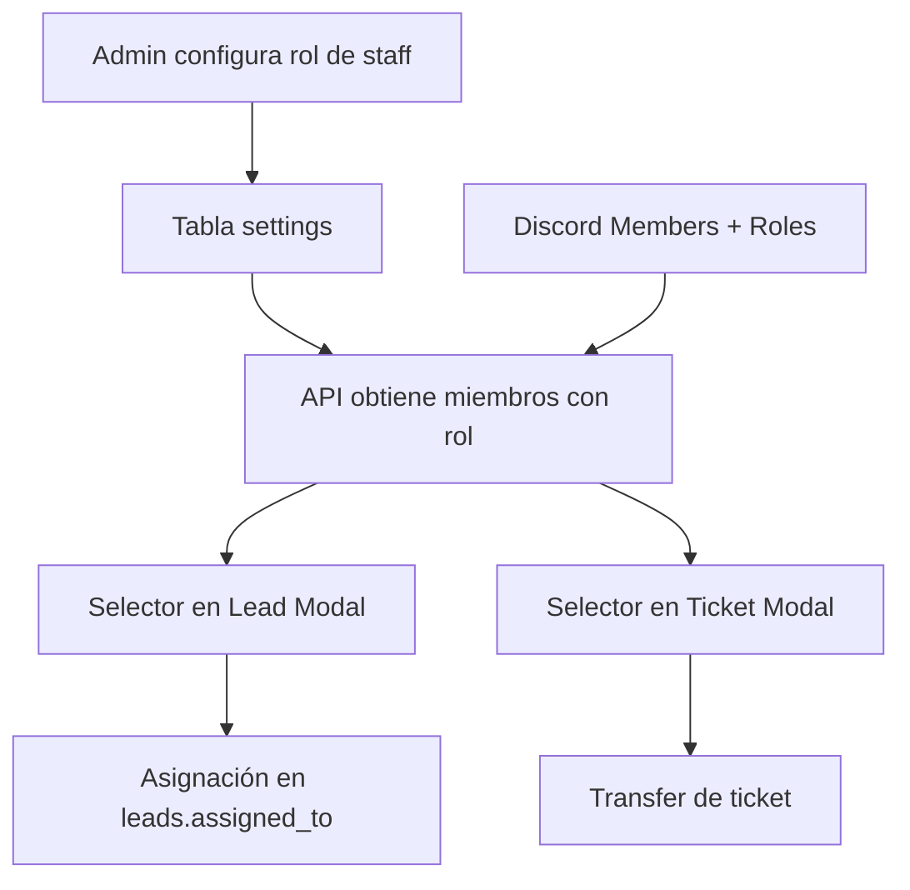

# Plan: Sistema de Gestión de Staff

## Arquitectura

El sistema consistirá en:
1. Tabla de configuración para guardar el rol de staff
2. Endpoints API para configuración y lista de staff
3. Página de configuración en el frontend
4. Modificación de UI de asignación en leads y tickets

## Base de Datos

### Nueva migración: `database/migrations/012_settings.sql`
- Tabla `settings` con columnas: `key VARCHAR PRIMARY KEY`, `value TEXT`, `updated_at TIMESTAMP`
- Insertar configuración inicial: `staff_role_id` con valor NULL

## Backend (API)

### Nuevos archivos:
- `api/src/features/settings/models/SettingsModel.ts` - Model para CRUD de settings
- `api/src/features/settings/routes/settings.ts` - Rutas:
  - `GET /api/settings` - Obtener todas las configuraciones
  - `PATCH /api/settings` - Actualizar configuración (body: `{key, value}`)

- `api/src/features/staff/routes/staff.ts` - Rutas:
  - `GET /api/staff/members` - Obtener miembros con rol de staff configurado
    - Lee `staff_role_id` desde settings
    - Filtra `discord_members` por rol (campo JSONB `roles`)
    - Retorna: `{id, username, display_name, avatar}`

### Modificaciones:
- `api/src/index.ts` - Montar nuevas rutas con authMiddleware
- Archivo existente `api/src/features/discord/models/DiscordMemberModel.ts` - Agregar método `getByRole(roleId: string)` para filtrar por rol

## Frontend (Web)

### Nueva página: `web/src/pages/Settings.tsx`
- Sección "Configuración de Staff"
- Selector de rol de Discord (dropdown con roles del servidor)
- Vista previa de miembros actuales con ese rol
- Botón guardar que llama a `PATCH /api/settings`

### Nuevo servicio: `web/src/services/settings.ts`
- `getSettings()` - GET /api/settings
- `updateSetting(key, value)` - PATCH /api/settings

### Nuevo servicio: `web/src/services/staff.ts`
- `getStaffMembers()` - GET /api/staff/members

### Modificaciones:

**1. Routing en `web/src/main.tsx`**
- Agregar ruta `/settings` con componente Settings

**2. Layout sidebar en `web/src/components/ui/Layout.tsx`**
- Agregar enlace a "Configuración" en el menú

**3. Lead Modal `web/src/components/leads/LeadModal.tsx`**
- Reemplazar input de texto "Asignado a" por selector (`<select>`)
- Cargar opciones desde `getStaffMembers()`
- Mostrar: display_name (username)
- Guardar: Discord user ID en `assigned_to`

**4. Ticket Chat Modal `web/src/components/tickets/modals/TicketChatModal.tsx`**
- Agregar sección "Asignado a" con selector de staff
- Botón "Transferir" que llama a `api.transferTicket(ticketId, newUserId, oldUserId)`
- Mostrar usuario actualmente asignado (desde `lead.assigned_to`)

**5. API service `web/src/services/api.ts`**
- La función `transferTicket` ya existe, solo conectarla en UI

## Componentes UI Reutilizables

Crear `web/src/components/ui/StaffSelector.tsx`:
- Componente reutilizable para selección de staff
- Props: `value`, `onChange`, `placeholder`
- Carga automática de staff members
- Estilo BMW design system

## Flujo de Uso

1. Admin va a `/settings`
2. Selecciona rol "Soporte" de Discord
3. Sistema muestra vista previa de 5 usuarios con ese rol
4. Admin guarda configuración
5. Al editar un lead, el campo "Asignado a" muestra dropdown con esos 5 usuarios
6. Al abrir un ticket, se puede ver y cambiar la asignación
7. Transfer actualiza permisos del canal en Discord

## Consideraciones Técnicas

- El campo `leads.assigned_to` sigue siendo VARCHAR(100) con Discord user ID
- La sincronización de miembros ya existe (tabla `discord_members`)
- El filtrado por rol se hace en la columna JSONB `roles` de `discord_members`
- Si no hay rol configurado, mostrar mensaje en vez de selector vacío
- Mantener retrocompatibilidad: si `assigned_to` tiene valor que no existe en staff, mostrarlo como "Usuario no encontrado"
